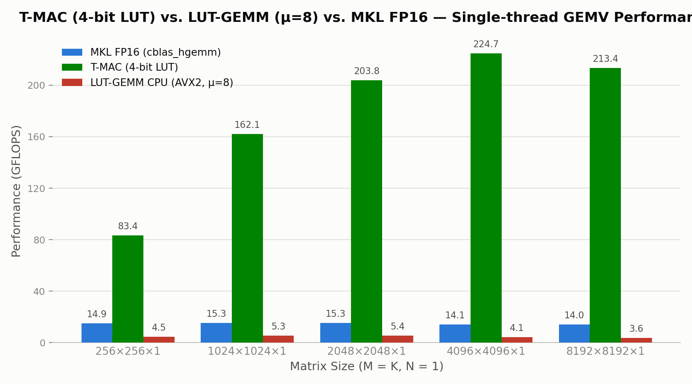

# T-MAC AVX2 vs. LUT-GEMM (CPU) vs. MKL FP16 GEMV Benchmark

比較 T-MAC（4-bit 量化 + Lookup Table）、LUT-GEMM（官方 CUDA kernel 的 CPU 移植版）與 Intel MKL（FP16 傳統浮點運算）在單執行緒 GEMV（矩陣乘向量，`M x K x 1`）情境下的效能表現。

## 概述

- **T-MAC**：以 4-bit 量化權重搭配預建查表（LUT，μ=4），用查表取代乘法運算，加速低位元推論。
- **LUT-GEMM**：移植自 [NAVER LUT-GEMM 官方 CUDA 核心](https://github.com/naver-aics/lut-gemm)（`mv_fp16_bias.hpp` 的 `_nqmv_bias`），採用 μ=8 的查表設計，提供純量（Scalar）與 AVX2 兩種 CPU 版本。
- **MKL**：使用 Intel MKL 的 `cblas_hgemm`，做為傳統 FP16 浮點乘加的效能基準。
- 三者皆固定 `N=1`（GEMV），對應語言模型推論階段每次生成一個 token 的實際運算情境。
- 皆附上正確性驗證（Checksum 或解析解比對），避免比較到「跑得快但算錯」的無意義數字。

## 測試環境

### 硬體規格

| 項目 | 規格 |
|---|---|
| 處理器 | 11th Gen Intel(R) Core(TM) i7-1165G7 @ 2.80GHz（4 核心 8 執行緒，最高 4.7GHz） |
| 快取（單核心） | L1d 48KB、L1i 32KB、L2 1.25MB（每核心）、L3 12MB（全核心共用） |
| 記憶體 | 16GB RAM |
| 顯示卡 | （本測試未使用 GPU） |
| 作業系統 | Fedora Linux 43（KDE Plasma） |
| 測試環境 | 原生 Linux（非虛擬機 / 非 WSL） |

> 本測試為 CPU 單執行緒 Benchmark，未使用 GPU。
> LUT-GEMM 官方設計目標平台為 GPU，本專案僅測試其算法移植到 CPU 之後的表現。

### 軟體環境

| 項目 | 版本 / 說明 |
|---|---|
| Linux 發行版 | Fedora Linux 43 |
| 核心版本 | Linux 7.0.9 |
| 編譯器 | GCC 15（g++） |
| 指令集 | AVX2 + FMA + F16C |
| 數學函式庫 | Intel oneAPI MKL 2026.1 |

## 環境建置

### 1. 啟用並進入 WSL

```powershell
wsl --install -d Ubuntu-24.04
wsl
```

### 2. 安裝編譯工具

```bash
sudo apt update
sudo apt install -y build-essential g++
```

### 3. 安裝 Intel oneAPI MKL

依照 [Intel oneMKL 官方安裝指南（Linux / apt）](https://www.intel.com/content/www/us/en/developer/tools/oneapi/onemkl-download.html?operatingsystem=linux&linux-install=apt) 進行安裝：

```bash
wget -O- https://apt.repos.intel.com/intel-gpg-keys/GPG-PUB-KEY-INTEL-SW-PRODUCTS.PUB \
  | gpg --dearmor \
  | sudo tee /usr/share/keyrings/oneapi-archive-keyring.gpg > /dev/null

echo "deb [signed-by=/usr/share/keyrings/oneapi-archive-keyring.gpg] https://apt.repos.intel.com/oneapi all main" \
  | sudo tee /etc/apt/sources.list.d/oneAPI.list

sudo apt update
sudo apt install -y intel-oneapi-mkl intel-oneapi-mkl-devel
```

安裝完成後，設定環境變數（每次開啟新終端機皆需執行，或加入 `~/.bashrc`）：

```bash
source /opt/intel/oneapi/setvars.sh
```

### 4. 確認 CPU 支援指令集

```bash
cat /proc/cpuinfo | grep -o 'avx2\|fma\|f16c' | sort -u
```

需同時看到 `avx2`、`fma`、`f16c` 三項，才能編譯與執行本專案。

## 建置與執行

### T-MAC AVX2 Benchmark

```bash
g++ -O2 -mavx2 -mfma t_mac_benchmark.cpp -o t_mac_benchmark
./t_mac_benchmark
```

### LUT-GEMM CPU Benchmark（純量版）

```bash
g++ -O3 lut_gemm_benchmark.cpp -o lut_gemm_benchmark
./lut_gemm_benchmark
```

> 純量版未使用任何 SIMD intrinsics，不需要額外的 `-m` 指令集旗標。

### LUT-GEMM CPU Benchmark（AVX2 優化版）

```bash
g++ -O3 -mavx2 -mfma lut_gemm_avx2_benchmark.cpp -o lut_gemm_avx2_benchmark
./lut_gemm_avx2_benchmark
```

> 必須同時加上 `-mavx2`（`_mm256_i32gather_ps` 為 AVX2 指令）與 `-mfma`（`_mm256_fmadd_ps` 為 FMA3 指令），缺一都會導致編譯期的 `inlining failed... target specific option mismatch` 錯誤。

### MKL FP16 Benchmark

```bash
g++ -O2 -mavx2 -mfma -mf16c \
    -I${MKLROOT}/include \
    mkl_benchmark.cpp \
    -L${MKLROOT}/lib/intel64 \
    -lmkl_intel_lp64 -lmkl_sequential -lmkl_core -lpthread -lm -ldl \
    -o mkl_benchmark

export LD_LIBRARY_PATH=${MKLROOT}/lib/intel64:$LD_LIBRARY_PATH
./mkl_benchmark
```

### （選用）記憶體安全性檢查

正式量測前，建議先以 AddressSanitizer 確認無記憶體越界問題（LUT-GEMM 的 gather 索引運算尤其容易出現越界，務必先跑過一次）：

```bash
g++ -g -O1 -mavx2 -mfma -fsanitize=address,undefined lut_gemm_avx2_benchmark.cpp -o lut_gemm_avx2_debug
./lut_gemm_avx2_debug
```

## Benchmark 結果

測試規模：`M = K = {256, 1024, 2048, 4096, 8192}`，`N = 1`，單執行緒，四支程式（T-MAC、LUT-GEMM 純量版、LUT-GEMM AVX2 版、MKL）皆統一取 **1000 次迭代**平均。



### T-MAC AVX2 GEMV

| Matrix Size | Latency (ms) | Performance (GFLOPS) | 正確性驗證 |
|---|---:|---:|---|
| 256×256×1 | 0.0016 | 83.41 | OK |
| 1024×1024×1 | 0.0129 | 162.10 | OK |
| 2048×2048×1 | 0.0412 | 203.84 | OK |
| 4096×4096×1 | 0.1493 | 224.72 | OK |
| 8192×8192×1 | 0.6289 | 213.43 | OK |

### LUT-GEMM CPU AVX2 版

| Matrix Size | Latency (ms) | Performance (GFLOPS) | 解析解驗證 |
|---|---:|---:|---|
| 256×256×1 | 0.0289 | 4.53 | output[0]=-512  OK |
| 1024×1024×1 | 0.3965 | 5.29 | output[0]=-2048  OK |
| 2048×2048×1 | 1.5651 | 5.36 | output[0]=-4096  OK |
| 4096×4096×1 | 8.1327 | 4.13 | output[0]=-8192  OK |
| 8192×8192×1 | 36.918 | 3.64 | output[0]=-16384  OK |

### LUT-GEMM CPU 純量版

| Matrix Size | Latency (ms) | Performance (GFLOPS) | 解析解驗證 |
|---|---:|---:|---|
| 256×256×1 | 0.0226 | 5.79 | output[0]=-512  OK |
| 1024×1024×1 | 0.4824 | 4.35 | output[0]=-2048  OK |
| 2048×2048×1 | 2.1273 | 3.94 | output[0]=-4096  OK |
| 4096×4096×1 | 11.5145 | 2.91 | output[0]=-8192  OK |
| 8192×8192×1 | 53.3253 | 2.52 | output[0]=-16384  OK |

### MKL FP16 GEMV

| Matrix Size | Latency (ms) | Performance (GFLOPS) | Checksum |
|---|---:|---:|---|
| 256×256×1 | 0.0088 | 14.90 |  OK |
| 1024×1024×1 | 0.1374 | 15.26 |  OK |
| 2048×2048×1 | 0.5475 | 15.32 |  OK |
| 4096×4096×1 | 2.3716 | 14.15 |  OK |
| 8192×8192×1 | 9.5598 | 14.04 |  OK |

## LUT-GEMM 跟記憶體存取的關係

我們使用 `perf stat` 與 `perf record`/`annotate` 對 T-MAC 與 LUT-GEMM 做分析，數據都是使用上面 Benchmark 結果的同一個二進位檔執行。

### 1. 4 條 gather 佔了約 74% 的執行週期

`perf record -g` + `perf annotate` 對 `lut_gemm_cpu_avx2` 來跑，結果內層迴圈中 4 條 `vgatherdps` 合計佔該函式 **73.65%** 的取樣週期（19.53% + 19.10% + 18.00% + 17.02%），遠遠超過其餘所有算術指令（`vaddps`、`vpand`、`vfmadd231ps` 等，加起來不到 3%）：

```
20.72 :  vmovdqu  (%r8), %ymm12
19.53 :  vgatherdps  %ymm9, 0x400(%rax,%ymm5,4), %ymm7
19.10 :  vgatherdps  %ymm7, (%rax,%ymm5,4), %ymm13
18.00 :  vgatherdps  %ymm10, 0x800(%rax,%ymm5,4), %ymm8
17.02 :  vgatherdps  %ymm11, 0xc00(%rax,%ymm14,4), %ymm5
 1.29 :  vaddps  %ymm13, %ymm0, %ymm0
 ...
```

這代表 CPU 大部分時間並非在做乘加等運算，而是卡在 gather 指令本身的記憶體的存取

### 2. Cache miss 與 IPC 比較（T-MAC vs LUT-GEMM AVX2）

`perf stat` 執行統計：

| 指標 | T-MAC（shuffle LUT，μ=4） | LUT-GEMM AVX2（gather LUT，μ=8） |
|---|---:|---:|
| cycles | 4,019,613,485 | 219,974,009,807 |
| instructions | 15,529,019,417 | 35,741,930,715 |
| **IPC**（instructions/cycle） | **3.86** | **0.16** |
| cache-references | 167,349,743 | 5,378,571,984 |
| cache-misses | 4,550,777 | 1,504,382,881 |
| **cache miss 率** | **2.7%** | **28.0%** |
| L1-dcache-loads | 1,489,368,432 | 7,099,300,909 |
| L1-dcache-load-misses | 310,729,866 | 9,282,479,487 |

同樣是查表法，LUT-GEMM 的 cache miss 率是 T-MAC 的約 10.3 倍，IPC 只有 T-MAC 的約 1/24。

### 3. 逐一矩陣規模（K）的 perf 數據

這裡我們來看看到底是從哪個 K 開始有問題。

我們把每個 K 拆成獨立執行檔、逐一用 `perf stat` 量測：

| K | Latency (ms) | GFLOPS | cycles | instructions | IPC | L1 miss / 1K instructions | LLC miss / 1K instructions |
|---:|---:|---:|---:|---:|---:|---:|---:|
| 256 | 0.0276 | 4.75 | 122,961,465 | 42,458,392 | 0.345 | 30.1 | 0.036 |
| 1024 | 0.4109 | 5.10 | 1,900,957,960 | 469,136,596 | 0.247 | 203.1 | 0.008 |
| 2048 | 1.6622 | 5.05 | 7,638,679,828 | 1,755,557,334 | 0.230 | 212.3 | 0.133 |
| 4096 | 7.2188 | 4.65 | 33,178,823,190 | 6,788,919,712 | 0.205 | 253.8 | 5.135 |
| 8192 | 36.7495 | 3.65 | 168,432,980,371 | 26,696,356,212 | 0.158 | 258.9 | 17.22 |

可以看到兩個值得注意的地方：

- L1 miss / 1K instructions：K=256->1024 跳了約 6.75 倍（30.1 -> 203.1）
- LLC miss / 1K instructions：K=2048->4096 跳了約 38.6 倍（0.133 -> 5.135），K=8192 再跳到 17.22（再 3.35 倍）。

單核心可用的快取容量：

| 快取層級 | 單核心可用容量 |
|---|---:|
| L1d | 48 KB |
| L2 | 1.25 MB |
| L3 | 12 MB |

LUT 本身的大小（`(K/8) × 256 × 4 bytes` = `K × 128 bytes`，因為要重複被同一個 K-chunk 內所有 M 列查詢，必須留在 cache 才有查表的意義）：

| K | LUT 大小 | vs. L1d (48KB) | vs. L2 (1.25MB) |
|---:|---:|---|---|
| 256 | 32 KB | 未超過 | 未超過 |
| 1024 | 128 KB | **已超過** | 未超過 |
| 2048 | 256 KB | **已超過** | 未超過 |
| 4096 | 512 KB | **已超過** | 未超過 |
| 8192 | 1 MB | **已超過** | 未超過 |

可以看得出來 LUT 從 K=1024 開始就已經放不進 L1d，但一路到 K=8192 都還放得進 L2，這和實測的 L1 miss/千指令在 K=256->1024 之間跳增近 6.75 倍完全相符。

而在 K=8192 真正出問題的不是 LUT，而是 weight 矩陣（`(K/32) × NUM_BITS * M * 4 bytes`，GEMV 每次仍要完整讀過一次）：

| K | W 矩陣大小 | vs. L3 (12MB) |
|---:|---:|---|
| 256 | 32 KB | 未超過 |
| 1024 | 512 KB | 未超過 |
| 2048 | 2 MB | 未超過 |
| 4096 | 8 MB | 接近（佔 L3 的 67%） |
| 8192 | 32 MB | **超過（是 L3 的 2.7 倍）** |

這跟 LLC miss/ K inst 在 K=2048->4096 開始明顯上升（0.133->5.135，此時 W 逼近 L3 容量，我猜測可能與其他資料互相排擠，這裡的實際測試佐證是 future work），K=8192 再惡化到 17.22（W 已確定裝不下 L3，一定會持續跟 DRAM 來回搬）。

## 結論

- **Performance T-MAC > MKL > LUT-GEMM（AVX2）**：8192 規模下，T-MAC 是 MKL 的約 15.2 倍、是 LUT-GEMM（AVX2）的約 58.6 倍。
- **最大的差異在查表指令，而且是固定成本**：T-MAC 的 16 格 LUT（μ=4）恰好落在 `_mm256_shuffle_epi8` 的定址範圍內，可用暫存器內單週期操作查表；LUT-GEMM 的 256 格 LUT（μ=8）超出此範圍，被迫使用 `_mm256_i32gather_ps`，該指令在多數 x86 CPU 上是拆解成多次獨立記憶體存取執行。即使在 LUT 完全放得進 L1d 的小 K（K=256），LUT-GEMM AVX2 的 IPC 也只有 0.345，遠低於 T-MAC 整體執行的 IPC 3.86——這是 gather 指令本身的固定開銷，跟 cache 是否夠大無關。
- **矩陣越大，T-MAC 越快，LUT-GEMM 卻越慢**：T-MAC 的查表成本能被更多輸出分攤，規模越大優勢越明顯；LUT-GEMM 則是兩層瓶頸疊加——LUT 從 K=1024 起超出單核心 L1d（48KB，L1 miss/ K inst 變成 6.75 倍），K=4096 起權重矩陣又逼近並超出 L3（12MB，LLC miss/ K inst 變成 38 倍以上），cache miss 隨規模增大而加劇，GFLOPS 在 K=1024 見頂後也逐步下滑。
- **架構不同的問題**：LUT-GEMM 的設計是針對 GPU shared memory 高頻寬、低延遲特性最佳化的結果，當移植到記憶體階層特性不同的 CPU 後，似乎無法重現同等加速效果。
- **MKL 為傳統標準矩陣乘法**：不使用量化或查表，效能不受矩陣結構影響，介於 14～15 GFLOPS，代表傳統浮點運算的效能水準；T-MAC 成功超越此基準，LUT-GEMM（CPU 版）則沒有超越。
- 所有測試皆為單執行緒，目的在於公平比較，而不是各方法的硬體效能極限。

## 正確性驗證方式

| 項目 | T-MAC | LUT-GEMM | MKL |
|---|---|---|---|
| 驗證方法 | Checksum 加總 + 逐點解析解比對 | Checksum + 解析解比對（`output[0]=-2×K`） | 已知輸入反推理論值（`C[0]=2×K`）比對 |
| 驗證強度 | 可精確驗證單點數值正確性 + 檢測記憶體污染、數值爆炸等異常 | 可精確驗證單點數值正確性 | 可精確驗證單點數值正確性（5% 容忍度） |

## 已知限制與注意事項

- 本測試固定使用單執行緒，未測試多執行緒平行效能。
- T-MAC 核心邏輯（`lut_ctor`、`tbl_update`）基於 [T-MAC 官方原始碼](https://github.com/microsoft/T-MAC) 改寫；LUT-GEMM 核心邏輯（LUT 建表、bias 讀取、查表累加）基於 [LUT-GEMM 官方 CUDA kernel](https://github.com/naver-aics/lut-gemm) 改寫，兩者運算邏輯與數值計算方式皆未經更動。
- LUT-GEMM 的 μ=8 為官方原始設計，本專案未修改此參數；若改用較小的 μ（例如 μ=4）搭配 `shuffle_epi8`，可能可改善 CPU 效能，但將偏離官方原始設計，非本專案測試範圍。
- 測試資料為固定合成數值，非真實模型權重，僅用於效能與正確性驗證，不代表真實推論任務下的表現。
- WSL2 環境可能因虛擬化層開銷與原生 Linux 環境有些微效能落差，非本測試控制範圍。

## 授權

原始 T-MAC 演算法版權歸屬 Microsoft（詳見 [T-MAC 官方 Repository](https://github.com/microsoft/T-MAC)）。
原始 LUT-GEMM 演算法版權歸屬 NAVER Cloud Corp.，採用 Apache License 2.0（詳見 [LUT-GEMM 官方 Repository](https://github.com/naver-aics/lut-gemm)）。
本專案為效能驗證與教學用途改寫。
