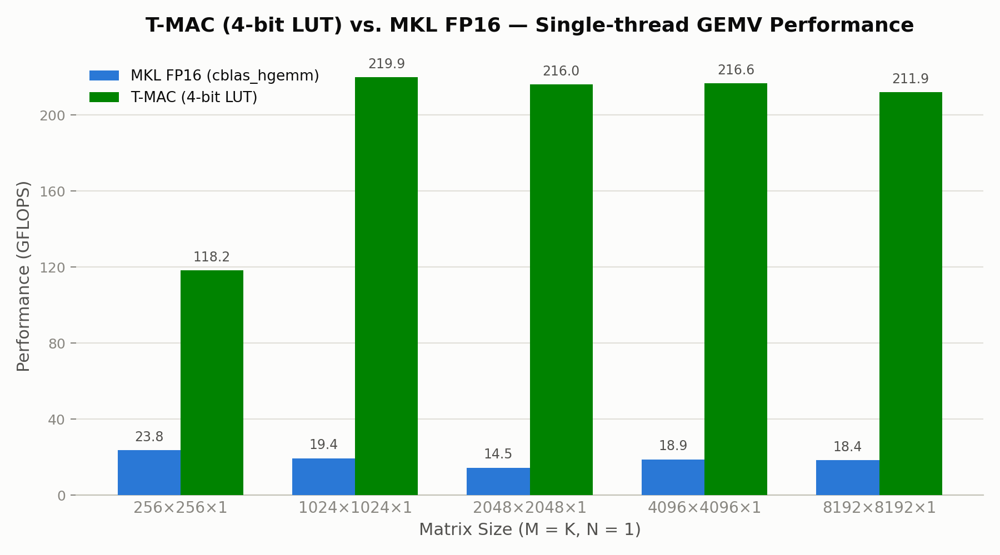

# T-MAC AVX2 vs. MKL FP16 GEMV Benchmark

比較 T-MAC（4-bit 量化 + Lookup Table）與 Intel MKL（FP16 傳統浮點運算）在單執行緒 GEMV（矩陣乘向量，`M x K x 1`）情境下的效能表現。

## 概述

- **T-MAC**：以 4-bit 量化權重搭配預建查表（LUT），用查表取代乘法運算，加速低位元推論。
- **MKL**：使用 Intel MKL 的 `cblas_hgemm`，做為傳統 FP16 浮點乘加的效能基準。
- 兩者皆固定 `N=1`（GEMV），對應語言模型推論階段每次生成一個 token 的實際運算情境。
- 皆附上正確性驗證（Checksum），避免比較到「跑得快但算錯」的無意義數字。

## 測試環境

本專案於兩台硬體規格不同的機器上執行，結果分開列出以利比較。原始數據分別存於 `benchmark_results.csv`（電腦 A）與 `benchmark_results_ultra9_185h.csv`（電腦 B）。

### 電腦 A：Intel Ultra 7 258V

#### 硬體規格

| 項目 | 規格 |
|---|---|
| 處理器 | Intel(R) Core(TM) Ultra 7 258V @ 2.20GHz |
| 記憶體 | 32 GB RAM |
| 顯示卡 | （本測試未使用 GPU） |
| 作業系統 | Windows 11 家用版，64 位元 |
| 測試環境 | WSL2（Windows Subsystem for Linux） |

#### 軟體環境

| 項目 | 版本 / 說明 |
|---|---|
| WSL | WSL2 |
| Linux 發行版 | Ubuntu 24.04.4 LTS (Noble Numbat) |
| 編譯器 | GCC 13（g++） |
| 指令集 | AVX2 + FMA + F16C |
| 數學函式庫 | Intel oneAPI MKL |

### 電腦 B：Intel Ultra 9 185H

#### 硬體規格

| 項目 | 規格 |
|---|---|
| 處理器 | Intel(R) Core(TM) Ultra 9 185H（11 核 22 執行緒）@ ~3.07GHz |
| 記憶體 | 16 GB RAM（WSL2 配置值） |
| 顯示卡 | （本測試未使用 GPU） |
| 作業系統 | Windows 11，64 位元 |
| 測試環境 | WSL2（Windows Subsystem for Linux） |

#### 軟體環境

| 項目 | 版本 / 說明 |
|---|---|
| WSL | WSL2 |
| Linux 發行版 | Ubuntu 22.04.5 LTS (Jammy Jellyfish) |
| 編譯器 | GCC 11.4.0（g++） |
| 指令集 | AVX2 + FMA + F16C |
| 數學函式庫 | Intel oneAPI MKL |

> 兩台機器皆為 CPU 單執行緒 Benchmark，未使用 GPU 加速。

## 環境建置

### 1. 啟用並進入 WSL

```powershell
wsl --install -d Ubuntu-24.04
wsl
```

### 2. 安裝編譯工具

```bash
sudo apt update
sudo apt install -y build-essential g++
```

### 3. 安裝 Intel oneAPI MKL

依照 [Intel oneMKL 官方安裝指南（Linux / apt）](https://www.intel.com/content/www/us/en/developer/tools/oneapi/onemkl-download.html?operatingsystem=linux&linux-install=apt) 進行安裝：

```bash
# 設定 Intel oneAPI 的 apt 套件庫金鑰與來源
wget -O- https://apt.repos.intel.com/intel-gpg-keys/GPG-PUB-KEY-INTEL-SW-PRODUCTS.PUB \
  | gpg --dearmor \
  | sudo tee /usr/share/keyrings/oneapi-archive-keyring.gpg > /dev/null

echo "deb [signed-by=/usr/share/keyrings/oneapi-archive-keyring.gpg] https://apt.repos.intel.com/oneapi all main" \
  | sudo tee /etc/apt/sources.list.d/oneAPI.list

sudo apt update
sudo apt install -y intel-oneapi-mkl intel-oneapi-mkl-devel
```

安裝完成後，設定環境變數（每次開啟新終端機皆需執行，或加入 `~/.bashrc`）：

```bash
source /opt/intel/oneapi/setvars.sh
```

### 4. 確認 CPU 支援指令集

```bash
cat /proc/cpuinfo | grep -o 'avx2\|fma\|f16c' | sort -u
```

需同時看到 `avx2`、`fma`、`f16c` 三項，才能編譯與執行本專案。

## 建置與執行

### T-MAC AVX2 Benchmark

```bash
g++ -O2 -mavx2 -mfma t_mac_benchmark.cpp -o t_mac_benchmark
./t_mac_benchmark
```

### MKL FP16 Benchmark

```bash
g++ -O2 -mavx2 -mfma -mf16c \
    -I${MKLROOT}/include \
    mkl_benchmark.cpp \
    -L${MKLROOT}/lib/intel64 \
    -lmkl_intel_lp64 -lmkl_sequential -lmkl_core -lpthread -lm -ldl \
    -o mkl_benchmark

export LD_LIBRARY_PATH=${MKLROOT}/lib/intel64:$LD_LIBRARY_PATH
./mkl_benchmark
```

### （選用）記憶體安全性檢查

正式量測前，建議先以 AddressSanitizer 確認無記憶體越界問題：

```bash
g++ -g -O1 -mavx2 -mfma -fsanitize=address,undefined t_mac_benchmark.cpp -o t_mac_debug
./t_mac_debug
```

## Benchmark 結果

測試規模：`M = K = {256, 1024, 2048, 4096, 8192}`，`N = 1`，單執行緒，每組取 100 次迭代平均。

### 電腦 A：Intel Ultra 7 258V


#### MKL FP16 GEMV

<table>
  <tr>
    <th width="22%" align="left">Matrix Size</th>
    <th width="15%" align="center">Latency (ms)</th>
    <th width="18%" align="center">Performance (GFLOPS)</th>
    <th width="43%" align="left">Checksum Verification</th>
  </tr>
  <tr>
    <td><b>256 x 256 x 1</b></td>
    <td align="center">0.0110604</td>
    <td align="center">11.8505</td>
    <td>C[0] = 512 (expected ~512) <b>OK</b></td>
  </tr>
  <tr>
    <td><b>1024 x 1024 x 1</b></td>
    <td align="center">0.184268</td>
    <td align="center">11.3810</td>
    <td>C[0] = 2048 (expected ~2048) <b>OK</b></td>
  </tr>
  <tr>
    <td><b>2048 x 2048 x 1</b></td>
    <td align="center">0.826103</td>
    <td align="center">10.1544</td>
    <td>C[0] = 4096 (expected ~4096) <b>OK</b></td>
  </tr>
  <tr>
    <td><b>4096 x 4096 x 1</b></td>
    <td align="center">2.324810</td>
    <td align="center">14.4332</td>
    <td>C[0] = 8192 (expected ~8192) <b>OK</b></td>
  </tr>
  <tr>
    <td><b>8192 x 8192 x 1</b></td>
    <td align="center">7.938100</td>
    <td align="center">16.9080</td>
    <td>C[0] = 16384 (expected ~16384) <b>OK</b></td>
  </tr>
</table>

#### T-MAC AVX2 GEMV

| Matrix Size | Latency (ms) | Performance (GFLOPS) | Checksum sum(out_c) |
| :--- | :---: | :---: | :--- |
| **256 x 256 x 1** | 0.00261465 | 50.1298 | $-4.9410 \times 10^6$ |
| **1024 x 1024 x 1** | 0.03161200 | 66.3403 | $-7.9056 \times 10^7$ |
| **2048 x 2048 x 1** | 0.13192500 | 63.5861 | $-3.1622 \times 10^8$ |
| **4096 x 4096 x 1** | 0.45567100 | 73.6374 | $-1.2649 \times 10^9$ |
| **8192 x 8192 x 1** | 1.48602000 | 90.3202 | $-5.0596 \times 10^9$ |

### 電腦 B：Intel Ultra 9 185H



#### MKL FP16 GEMV

<table>
  <tr>
    <th width="22%" align="left">Matrix Size</th>
    <th width="15%" align="center">Latency (ms)</th>
    <th width="18%" align="center">Performance (GFLOPS)</th>
    <th width="43%" align="left">Checksum Verification</th>
  </tr>
  <tr>
    <td><b>256 x 256 x 1</b></td>
    <td align="center">0.00550452</td>
    <td align="center">23.8117</td>
    <td>C[0] = 512 (expected ~512) <b>OK</b></td>
  </tr>
  <tr>
    <td><b>1024 x 1024 x 1</b></td>
    <td align="center">0.107862</td>
    <td align="center">19.4430</td>
    <td>C[0] = 2048 (expected ~2048) <b>OK</b></td>
  </tr>
  <tr>
    <td><b>2048 x 2048 x 1</b></td>
    <td align="center">0.579191</td>
    <td align="center">14.4833</td>
    <td>C[0] = 4096 (expected ~4096) <b>OK</b></td>
  </tr>
  <tr>
    <td><b>4096 x 4096 x 1</b></td>
    <td align="center">1.779180</td>
    <td align="center">18.8595</td>
    <td>C[0] = 8192 (expected ~8192) <b>OK</b></td>
  </tr>
  <tr>
    <td><b>8192 x 8192 x 1</b></td>
    <td align="center">7.276950</td>
    <td align="center">18.4442</td>
    <td>C[0] = 16384 (expected ~16384) <b>OK</b></td>
  </tr>
</table>

#### T-MAC AVX2 GEMV

| Matrix Size | Latency (ms) | Performance (GFLOPS) | Checksum sum(out_c) |
| :--- | :---: | :---: | :--- |
| **256 x 256 x 1** | 0.00110915 | 118.173 | $-4.9410 \times 10^6$ |
| **1024 x 1024 x 1** | 0.00953800 | 219.873 | $-7.9056 \times 10^7$ |
| **2048 x 2048 x 1** | 0.03882950 | 216.037 | $-3.1622 \times 10^8$ |
| **4096 x 4096 x 1** | 0.15490900 | 216.608 | $-1.2649 \times 10^9$ |
| **8192 x 8192 x 1** | 0.63328000 | 211.941 | $-5.0596 \times 10^9$ |

## 重點結論

- 相同 `M x K x 1` 規模下，T-MAC 的 GFLOPS 均顯著高於 MKL：電腦 A 約為 **4～6 倍**（8192 規模：90.3 vs. 16.9 GFLOPS），電腦 B 約為 **5～15 倍**（8192 規模：211.9 vs. 18.4 GFLOPS）。
- 矩陣規模越大，T-MAC 的優勢越明顯，因建表成本可由更多輸出共同攤提；此趨勢在兩台機器上一致。
- MKL 於小矩陣（256）效率偏低，隨規模放大才逐漸提升，兩台機器皆有相同情況。
- 電腦 B 在 T-MAC 與 MKL 上的絕對 GFLOPS 皆高於電腦 A，但 T-MAC 的相對加速倍率在電腦 B 上更明顯，顯示查表法對硬體差異的需求可能與傳統浮點運算不同，可能可以藉由更多硬體的比較得到推論。
- T-MAC 的 GFLOPS 為「等效 FLOPS」（相當於用傳統乘加完成同樣運算所需的運算量），並非實際執行的乘法次數，因查表法本身即刻意避開多數乘法。
- 兩者皆為單執行緒、未做深度硬體調校的結果，目的在於公平比較，非各自硬體的效能極限。

## 正確性驗證方式

| 項目 | T-MAC | MKL |
|---|---|---|
| 驗證方法 | 依固定合成輸入（activation 全為 `1.0f`、weight nibble 固定為 `0x1`）獨立推導理論期望值，逐元素與實際輸出比對 + NaN/Inf 檢查 | 已知輸入反推理論值（`C[0] = 2×K`）比對 |
| 驗證強度 | 逐元素比對整個輸出陣列，可驗證數值正確性，可檢測記憶體污染、數值爆炸等異常 | 可精確驗證單點數值正確性（5% 容忍度） |
| 限制 | 期望值僅針對本測試固定的合成輸入推導，非通用於任意weight/activation 組合 | 僅驗證單一元素，非全陣列 |

## 已知限制與注意事項

- 本測試固定使用單執行緒（`OMP_NUM_THREADS=1` / `mkl_set_num_threads(1)`），未測試多執行緒平行效能。
- T-MAC 核心邏輯（`lut_ctor`、`tbl_update`）基於 [T-MAC 官方原始碼](https://github.com/microsoft/T-MAC) 改寫，運算邏輯與數值計算方式未經更動。
- 原始 T-MAC 演算法版權歸屬 Microsoft（詳見 [T-MAC 官方 Repository](https://github.com/microsoft/T-MAC)）。本專案為效能驗證與研究用途改寫。
- 測試資料為固定合成數值（activation 全為 1.0，權重固定 pattern），非真實模型權重，僅用於效能與正確性驗證，不代表真實推論任務下的表現。
- WSL2 環境可能因虛擬化層開銷（如記憶體存取延遲）與原生 Linux 環境有些微效能落差，非本測試控制範圍。
