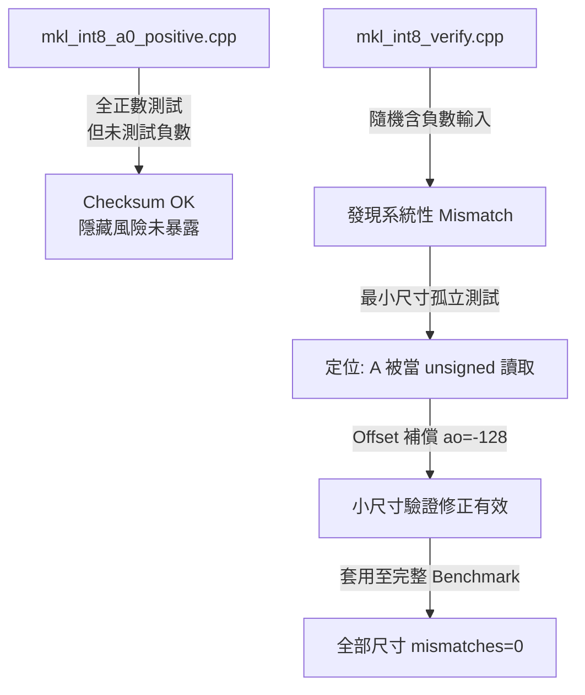

# MKL INT8 GEMV 底層 API 陷阱驗證與效能分析

本文延續 T-MAC 驗證架構的方法論，針對 Intel MKL 的 `cblas_gemm_s8u8s32` API 進行同等嚴謹的正確性交叉驗證。透過兩份互為對照的程式碼，我們發現並定位了這個 API 在特定呼叫方式下的一個隱藏陷阱，並提出經實測驗證有效的修正方案。

---

## 1. `mkl_int8_a0_positive.cpp`：原始呼叫方式與全正數測試

### 定位
MKL INT8 GEMV 效能基準，但測試資料刻意限制在全正數範圍。

### 核心功能
* 呼叫 `cblas_gemm_s8u8s32`，`ao=0`、`bo=0`（無 offset 補償）。
* 測試資料：A 全部設為 1（`int8_t`），B 全部設為 2（`uint8_t`）。
* 驗證方式：checksum C[0] 與解析解 $2 \times K$ 比對。

### 執行結果

| Matrix Size | Latency | Performance | Checksum |
| :--- | :---: | :---: | :--- |
| **256x256** | 0.00226345ms | 57.908 GFLOPS | C[0]=512（expected 512）**OK** |
| **1024x1024** | 0.0540425ms | 38.8056 GFLOPS | C[0]=2048（expected 2048）**OK** |
| **2048x2048** | 0.172655ms | 48.5861 GFLOPS | C[0]=4096（expected 4096）**OK** |
| **4096x4096** | 0.630036ms | 53.258 GFLOPS | C[0]=8192（expected 8192）**OK** |
| **8192x8192** | 2.72577ms | 49.2403 GFLOPS | C[0]=16384（expected 16384）**OK** |

全部尺寸 checksum 皆為 OK，效能落在 38~58 GFLOPS 之間。

### 這份驗證證明了什麼——以及沒有證明什麼
* **證明了**：在 A、B 皆為正數的條件下，`cblas_gemm_s8u8s32` 的呼叫方式（`ao=0`, `bo=0`）能得出數學正確的結果。
* **沒有證明的事**：這份測試從未使用過負數輸入。checksum 的驗證通過，只代表「在全正數輸入下，這個 API 呼叫方式是正確的」，不能推論到「這個 API 呼叫方式在一般情況下都是正確的」——這正是下一份程式碼要檢驗的問題，也是本次分析最終發現問題的地方。

---

## 2. `mkl_int8_verify.cpp`：隨機輸入與 Offset 補償修正

### 定位
獨立正確性交叉驗證，透過隨機含負數輸入暴露原始呼叫方式的隱藏問題，並提出經實測驗證的修正方案。

### 問題發現過程
在改用隨機輸入（$A \in [-16, 16]$, $B \in [0, 16]$）後，直接沿用 `ao=0`, `bo=0` 的呼叫方式，輸出結果與純量三層迴圈 ground truth 出現系統性、大幅度的 mismatch（例如 K=256 時，理論最大值應為 $256 \times 256 = 65536$，但實際輸出高達 248285，超過理論上限近 4 倍）。

透過最小尺寸（M=K=4）的孤立測試，逐步縮小問題範圍：

| 測試案例 | 結果 |
| :--- | :--- |
| **全正 A（M=K=4）** | 完全正確 |
| **全負 A（M=K=4）** | 全部錯誤 |
| **混合正負 A（M=K=4）** | 全部錯誤 |

進一步用「全負 A」案例做數學核對：若將 A={-1,-2,-3,-4} 的位元組當成 unsigned 讀取（-1 $\rightarrow$ 255, -2 $\rightarrow$ 254, -3 $\rightarrow$ 253, -4 $\rightarrow$ 252），計算結果與 MKL 實際輸出（2028）完全吻合。這證實：`cblas_gemm_s8u8s32` 在此呼叫方式下，會將 `int8_t* A` 這個參數的位元組內容當成 unsigned 讀取，而非預期的 signed。

> **補充說明**：關於此現象背後具體的底層實作機制（例如是否與 RowMajor 記憶體佈局轉換有關），因缺乏 MKL 原始碼佐證，本文不做臆測，僅陳述已透過實測確認的現象與修正方法。

### 修正方案：Offset 補償
利用 API 定義 $C = (A + \text{ao}) \times B$，將 A 資料以 $\text{unsigned}(x) = x + 128$ 的方式儲存（把 -128~127 映射到 0~255），並設定 $\text{ao} = -128$ 補償這個位移，使其在數學上還原為原始 signed 數值：

$$\text{unsigned}(x) + \text{ao} = (x + 128) + (-128) = x$$

此修正法先在最小尺寸案例中驗證：

| 測試案例 | 修正後結果 |
| :--- | :--- |
| **全正 A（M=K=4）** | OK，逐元素相符 |
| **全負 A（M=K=4）** | OK，逐元素相符 |
| **混合正負 A（M=K=4）** | OK，逐元素相符 |

確認修正法有效後，套用至完整隨機輸入 benchmark。

### 執行結果（Offset 修正版，隨機輸入含負數）

| Matrix Size | Latency | Performance | Verify |
| :--- | :---: | :---: | :--- |
| **256x256** | 0.0182021ms | 7.20094 GFLOPS | mismatches=0/256, max_abs_err=0（OK - exact match） |
| **1024x1024** | 0.172315ms | 12.1704 GFLOPS | mismatches=0/1024, max_abs_err=0（OK - exact match） |
| **2048x2048** | 0.703074ms | 11.9313 GFLOPS | mismatches=0/2048, max_abs_err=0（OK - exact match） |
| **4096x4096** | 3.75669ms | 8.93193 GFLOPS | mismatches=0/4096, max_abs_err=0（OK - exact match） |
| **8192x8192** | 14.3122ms | 9.37785 GFLOPS | mismatches=0/8192, max_abs_err=0（OK - exact match） |

全部尺寸與純量三層迴圈逐元素完全相等（`max_abs_err=0`），這符合預期——因為 `cblas_gemm_s8u8s32` 是純整數運算，沒有任何四捨五入或量化步驟，理論上不應存在任何誤差，這點與 T-MAC 因 int8 量化查表而必然存在的浮點捨入誤差性質不同。

### 效能落差分析
修正後版本效能（7~12 GFLOPS）明顯低於原始全正數版本（38~58 GFLOPS），約有 4~6 倍差距。這個差距可歸因於：$\text{ao} \neq 0$ 時，MKL 必須額外計算展開式 $C = A \times B + \text{ao} \times \sum B$ 中的補償項，這項額外的求和與加法運算，相較於 $\text{ao}=0, \text{bo}=0$ 時可能存在的高度優化路徑，帶來了顯著的效能開銷。

> **補充說明**：關於此效能落差背後具體的 CPU 指令層級機制（例如是否觸發特定的 fallback 路徑），同樣缺乏官方文件佐證，本文僅呈現已測量的效能數字與合理的高層次解釋，不做無法驗證的底層臆測。

---

## 3. 系統驗證工作流（Workflow）

## 4. 結論
- mkl_int8_a0_positive.cpp 證明了：在全正數測試資料下，ao=0 的呼叫方式數值正確，但這個驗證範圍不足以代表一般情況（尤其是 LLM 權重必然包含負值的真實推論場景）。
- mkl_int8_verify.cpp 證明了：透過隨機含負數輸入與最小尺寸孤立測試，可以定位出 API 在特定呼叫方式下的資料型別解讀問題，並透過 offset 補償法修正，使結果在所有測試尺寸下與純量 ground truth 逐元素完全相等。