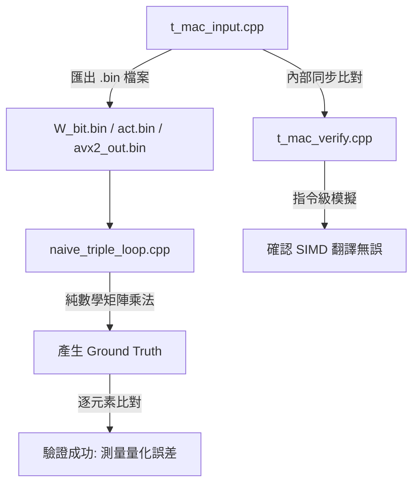

# T-MAC 底層核心驗證與效能測試架構解析

本專案旨在實作並驗證微軟 T-MAC（基於查表的低位元 LLM 推論框架）的核心 C++ AVX2 矩陣乘法（GEMV）。為了避免底層記憶體交錯（Interleaved Memory Layout）帶來的「自我對答案（Self-Fulfilling Prophecy）」盲點，我們將測試架構拆分為三個獨立的程式碼檔案，形成一套完整的交叉驗證流水線。

---

## 1. t_mac_input.cpp：資料生成與 AVX2 核心引擎

### 定位
測資產生器與高效能 AVX2 運算基準。

### 核心功能
* 亂數資料生成：使用 `std::mt19937`（固定 `seed=42`，便於重現除錯）產生隨機的 FP32 Activation 與 0/1 的二進位純淨權重（W_bit）。
* 離線權重打包（`pack_tmac_weights`）：將人類可讀的二維 0/1 權重陣列，依照 T-MAC 的規範，壓成具有空間交錯與高低 Nibble 拆分的 uint8_t 特化記憶體格式。
* 線上建表與查表（`lut_ctor_g4_int8_avx2` 與 `tbl_update_avx2`）：執行包含 INT8 動態量化、暫存器洗牌（PSHUF）以及 INT16 快速聚合（Fast Aggregation）的 AVX2 最佳化演算法。
* 序列化匯出（Binary Export）：將原始的 W_bit、activations 以及 out_c（AVX2 計算結果）匯出成 .bin 檔案，切斷後續驗證程式與 AVX2 記憶體狀態的連結。

### 執行結果（Activation 範圍 [-5.0, 5.0]）

| Matrix Size | AVX2 Latency | Performance |
| :--- | :---: | :---: |
| **256x256** | 0.00328945ms | 39.8462 GFLOPS |
| **1024x1024** | 0.035472ms | 59.1214 GFLOPS |
| **2048x2048** | 0.114007ms | 73.58 GFLOPS |
| **4096x4096** | 0.407388ms | 82.3649 GFLOPS |
| **8192x8192** | 1.35901ms | 98.7617 GFLOPS |

此結果僅代表 AVX2 kernel 的原始效能，尚未驗證正確性——正確性驗證由後兩份程式碼負責。

---

## 2. t_mac_verify.cpp：硬體指令模擬與自我驗證

### 定位
純量版 AVX2 模擬器（SIMD 邏輯除錯器），驗證「AVX2 指令是否正確翻譯了預期的運算」。

### 核心功能
* `tbl_update_scalar_foolproof`：完全照抄 AVX2 的外層迴圈步長（`for (i = 0; i < m/2; i += 16)`），用長度 8 的 float 陣列模擬 256-bit 暫存器行為，逐一複製 `_mm256_shuffle_epi8`、`_mm256_fmadd_ps` 等指令對應的數學運算。
* 零指標推導：位址公式（`i/4+group`、`i*2+offset`）與 AVX2 版本逐字相同，不做任何跨維度反推，排除「因指令用錯導致數值錯誤」的風險。

### 執行結果（任意隨機輸入，Activation 範圍 [-5.0, 5.0]）

| Matrix Size | AVX2 Performance | Status | Max Error |
| :--- | :---: | :---: | :---: |
| **256x256** | 0.0018342ms (71.46 GFLOPS) | OK | 1.52588e-05 |
| **1024x1024** | 0.0318484ms (65.848 GFLOPS) | OK | 3.05176e-05 |
| **2048x2048** | 0.099428ms (84.3687 GFLOPS) | OK | 6.10352e-05 |
| **4096x4096** | 0.34142ms (98.2792 GFLOPS) | OK | 9.15527e-05 |
| **8192x8192** | 0.60852ms (220.564 GFLOPS) | OK | 0.000244141 |

全部尺寸皆為 OK，誤差量級落在 1e-5~1e-4，屬於浮點數運算順序不同造成的正常捨入誤差（非邏輯錯誤）。

### 這份驗證證明了什麼
* AVX2 kernel 的 SIMD 指令翻譯正確：`shuffle_epi8` 查表、`fmadd_ps` 乘加、暫存器拆分重組等硬體操作，與其對應的純量數學定義完全一致。
* 這份驗證的範圍：只確認「AVX2 版本忠實執行了它自己設計的位址映射與運算流程」，不能單獨證明這個位址映射本身是否正確對應 T-MAC 論文原始定義——這正是第三份程式碼要處理的問題。

---

## 3. naive_triple_loop.cpp：無塵室獨立驗證（Ground Truth）

### 定位
絕對數學真理的交叉驗證，驗證「T-MAC 的記憶體佈局與查表演算法，在數學上是否等價於標準矩陣乘法」。

### 核心功能
* 獨立資料讀取：直接從 .bin 檔案讀取 `t_mac_input.cpp` 產生的未壓縮權重與輸入，驗證過程與打包演算法徹底脫鉤。
* 獨立數學推導：透過 `channel_block_idx = mm/8`、`bit_plane = channel_block_idx % Bits`、`gets_bias = (bit_plane==0)` 判斷 bias 分配，不依賴 AVX2 內部變數（`i`、`group` 等）。
* 純樸迴圈：用最基礎的 FP32 乘加（`w_math * activations[kk]`）算出內積，完全不涉及 int8 量化。
* 逐元素比對：與 AVX2 讀入的結果比較，容忍度設計吸收量化誤差。

### 執行結果一：Activation 範圍 [-5.0, 5.0]

| Matrix Size | Naive Latency | Mismatches | Max Error |
| :--- | :---: | :---: | :---: |
| **256x256** | 0.498131ms | 29/256 | 0.730721 |
| **1024x1024** | 10.0896ms | 157/1024 | 2.16095 |
| **2048x2048** | 32.3011ms | 366/2048 | 2.93166 |
| **4096x4096** | 123.586ms | 629/4096 | 4.07655 |
| **8192x8192** | 395.567ms | 1401/8192 | 6.71378 |

### 執行結果二：Activation 範圍縮小為 [-0.1, 0.1]

| Matrix Size | Naive Latency | Mismatches | Max Error |
| :--- | :---: | :---: | :---: |
| **256x256** | 0.547463ms | 0/256 | 0.0146145 |
| **1024x1024** | 8.12529ms | 0/1024 | 0.0432194 |
| **2048x2048** | 46.2748ms | 0/2048 | 0.0586333 |
| **4096x4096** | 116.834ms | 12/4096 | 0.0815302 |
| **8192x8192** | 409.891ms | 91/8192 | 0.134274 |

### 兩組結果的分析與解讀

#### 為什麼縮小 activation 範圍後 mismatch 大幅下降？
`lut_ctor_g4_int8_avx2` 會把浮點數查表值四捨五入壓縮成 int8（範圍 -128~127）。當 activation 數值範圍越大，量化前後的絕對誤差也會等比放大；縮小範圍後，量化捨入造成的絕對誤差自然跟著縮小，因此 mismatch 數量大幅降低（256/1024/2048 三組完全歸零）。這證實了：mismatch 的主要來源是 int8 量化的捨入誤差，而非邏輯錯誤。

#### 為什麼縮小範圍後，4096 與 8192 仍有少量 mismatch（12、91 個）？
四捨五入本身存在邊界效應：當某次累加值剛好落在 x.5 附近，AVX2（int16 快速聚合）與純量版（未量化的 FP32 累加）的運算順序差異，會導致捨入方向不同，產生一個相對較大的單點誤差。矩陣規模越大，累加運算次數越多，統計上「撞到捨入邊界」的次數也會等比增加——這正好解釋了 mismatch 數量隨規模上升的現象（256→0、1024→0、2048→0、4096→12、8192→91，呈現規模越大、邊界情況越多的趨勢），這是 int8 量化 kernel 的統計必然性，不是程式邏輯缺陷。

#### bias 分組公式的代數驗證
`naive_triple_loop.cpp` 採用的 `mm/8 % Bits` 公式，與 AVX2 版本內部 `i/4+group` 的映射關係，經過代數展開驗證為完全等價（`m = i*2 + group*8 + lane`，代入 `mm/8` 化簡後得到 `4*i/4 + group`，與 AVX2 傳入 `lut_fma` 的 `ib` 參數一致）。這確保了 bias 分配邏輯的獨立驗證與 AVX2 實作使用的是同一組數學定義，而非巧合對齊。

---

## 4. 系統驗證工作流（Workflow）

## 5. 結論：
這三份程式碼構成兩層獨立、互補的驗證：
- `t_mac_verify.cpp` 證明了：這份 AVX2 kernel 沒有 SIMD 指令誤用（shuffle/fmadd/暫存器搬移皆正確）。

- `naive_triple_loop.cpp` 證明了：T-MAC 複雜的交錯記憶體佈局與查表演算法，在數學本質上等價於標準矩陣乘法，觀察到的誤差可歸因於 int8 表格量化的捨入效應，且該效應隨數值範圍縮小而可預期地減少。

- 兩者合起來，構成了一條從「硬體指令層級」到「演算法/數學層級」的完整驗證鏈，可以合理確認：這份 T-MAC AVX2 實作在邏輯上是正確的，觀察到的數值差異屬於量化推論的預期誤差範圍，而非程式錯誤。
