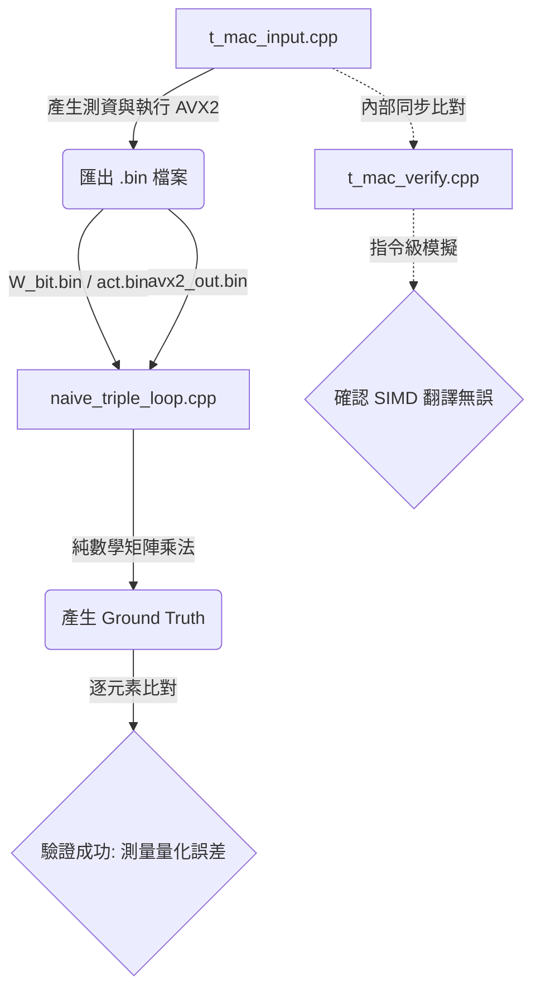

# T-MAC 底層核心驗證與效能測試架構解析

本專案旨在實作並驗證微軟 T-MAC（基於查表的低位元 LLM 推論框架）的核心 C++ AVX2 矩陣乘法（GEMV）。為了避免底層記憶體交錯（Interleaved Memory Layout）帶來的「自我對答案（Self-Fulfilling Prophecy）」盲點，我們將測試架構拆分為三個獨立的程式碼檔案，形成一套完整的交叉驗證流水線。

## 1. `t_mac_input.cpp`：資料生成與 AVX2 核心引擎

### 定位

測資產生器與高效能 AVX2 運算基準。

這份程式碼是整個系統的「火車頭」，負責執行最高效能的 T-MAC 演算法，並將測資匯出給其他程式進行獨立驗證。

### 核心功能

* 亂數資料生成：使用 `std::mt19937` 產生隨機的 FP32 Activation 與 0/1 的二進位純淨權重（`W_bit`）。
* 離線權重打包（`pack_tmac_weights`）：將人類可讀的二維 0/1 權重陣列，嚴格依照 T-MAC 的規範，壓成具有空間交錯與高低 Nibble 拆分的 `uint8_t` 特化記憶體格式。
* 線上建表與查表（`lut_ctor_g4_int8_avx2` 與 `tbl_update_avx2`）：執行包含 INT8 動態量化、暫存器洗牌（PSHUF）以及 INT16 快速聚合（Fast Aggregation）的 AVX2 最佳化演算法。
* 序列化匯出（Binary Export）：運算完成後，將原始的 `W_bit`、`activations` 以及 `out_c`（AVX2 的計算結果）匯出成 `.bin` 檔案，徹底切斷後續驗證程式與 AVX2 記憶體狀態的連結。

## 2. `t_mac_verify.cpp`：硬體指令模擬與自我驗證

### 定位

純量版 AVX2 模擬器（SIMD 邏輯除錯器）。

在開發高複雜度的 AVX2 Kernel 時，很容易因為 `_mm256_shuffle_epi8` 或 `_mm256_packs` 的遮罩寫錯而導致算出版亂碼。這份程式碼的目的是驗證 SIMD 指令的翻譯是否正確。

### 核心功能

* `tbl_update_scalar_foolproof` 函式：這是一個最笨但絕對不會出錯的純量對照組。它完全照抄 AVX2 的外層迴圈步長（例如 `for (i = 0; i < m / 2; i += 16)`），並使用長度為 8 的 float 陣列（如 `c0`、`v00`）來精準模擬 256-bit 暫存器的行為。
* 零指標推導：它刻意不去做任何高階的記憶體反推，直接套用與 AVX2 一模一樣的位址公式（如 `i / 4 + 1`），藉此排除「因為指令用錯而導致數值錯誤」的風險，確保 C++ 迴圈能 1:1 還原硬體微指令（Micro-ops）。

## 3. `naive_triple_loop.cpp`：無塵室獨立驗證（Ground Truth）

### 定位

絕對數學真理的交叉驗證。

這是本架構中最具學術與工程價值的程式碼。它不包含任何 AVX2 的影子，也不包含為了硬體對齊而設計的 Magic Numbers（如 32、4 等），它代表了純粹的數學定義。

### 核心功能

* 獨立資料讀取：直接從 `.bin` 檔案讀取由 `t_mac_input.cpp` 產生的未壓縮權重與輸入，確保驗證過程與打包演算法徹底脫鉤。
* T-MAC 獨立數學推導：利用最純粹的 T-MAC 論文邏輯來計算 Bias 分配。透過 `channel_block_idx = mm / 8` 計算區塊，並以 `bit_plane = channel_block_idx % Bits` 與 `gets_bias = (bit_plane == 0)` 來決定全域 Bias 的歸屬，徹底擺脫 AVX2 的硬體思維。
* 教科書級純樸迴圈：使用最基礎的 FP32 乘加運算（`w_math * activations[kk]`）算出完美的數學矩陣內積。
* 量化誤差分析（Quantization Error Analysis）：將計算結果與 AVX2 讀入的結果逐元素比對。藉由容忍度設計（`err > 0.02 * std::fabs(out_gt[i]) + 0.05`），成功驗證了 T-MAC 的硬體演算法在引入 INT8 表格量化與 INT16 聚合後，仍能將相對誤差控制在極小範圍內，實現精度與速度的平衡。

## 4. 系統驗證工作流（Workflow）

## 5. 結論

這三份程式碼構成了一道堅不可摧的驗證防線：

* 透過 `t_mac_verify.cpp`，我們確認了 SIMD 暫存器操作正確。
* 透過 `naive_triple_loop.cpp`，我們確認了 T-MAC 複雜的交錯記憶體佈局與查表演算法，在數學上等價於標準矩陣乘法。
* 透過 `t_mac_input.cpp`，我們完成了高效能實作、測資輸出與後續驗證之間的完整切分。

這套架構同時兼顧效能、正確性與可驗證性，適合作為 T-MAC 核心 Kernel 開發與測試的基礎框架。
