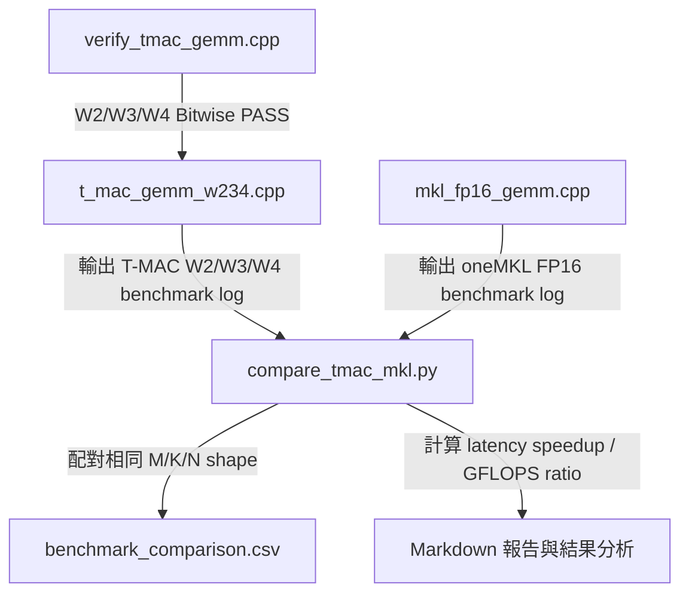

# T-MAC W2/W3/W4 與 oneMKL FP16 GEMM 效能比較報告

本報告整理 `t_mac_gemm_w234.cpp` 與 `mkl_fp16_gemm.cpp` 在相同矩陣尺寸下的 benchmark 結果，目標是比較低位元 T-MAC LUT-GEMM 在 CPU AVX2 上相對於 oneMKL FP16 GEMM baseline 的效能差異。測試結果由 `compare_tmac_mkl.py` 自動執行兩份 benchmark、解析輸出、配對相同 shape，並計算 latency、GFLOPS 與相對 speedup。

---

## 1. 測試架構總覽

### 定位
建立一套可重現的 CPU GEMM 對照測試流程，將 T-MAC W2/W3/W4 與 oneMKL W16A16 放在相同矩陣形狀、相同 batch size 與相同單執行緒條件下比較。

### 核心組成
* `verify_tmac_gemm.cpp`：正確性驗證程式，用 scalar golden reference 對照 AVX2 tiled implementation。W2/W3/W4 已完成 Bitwise PASS 驗證。
* `t_mac_gemm_w234.cpp`：T-MAC W2A16、W3A16、W4A16 統一 benchmark 程式，使用相同測試矩陣清單輸出 latency、等效 GFLOPS 與 iteration。
* `mkl_fp16_gemm.cpp`：oneMKL FP16 GEMM benchmark，計算 `output = activations[N x K] * weights[M x K]^T`，作為 W16A16 dense GEMM baseline。
* `compare_tmac_mkl.py`：自動執行兩份 benchmark，解析相同 shape，輸出對照表與 `benchmark_comparison.csv`。

### 測試精度設定
| 實作 | 權重格式 | Activation 格式 | 說明 |
| :--- | :---: | :---: | :--- |
| T-MAC W2A16 | W2 packed low-bit | FP32 Activation 建表 | 低位元查表 kernel |
| T-MAC W3A16 | W3 packed low-bit | FP32 Activation 建表 | 低位元查表 kernel |
| T-MAC W4A16 | W4 packed low-bit | FP32 Activation 建表 | 低位元查表 kernel |
| oneMKL FP16 | W16 dense FP16 | A16 FP16 | 標準 dense FP16 GEMM baseline |

> 注意：T-MAC 的 GFLOPS 是以 `2*M*K*N` 換算出的「等效 GEMM throughput」，不是實際硬體執行的 FP16 FLOP 數。正式比較時應優先觀察 latency speedup。

---

## 2. 測試矩陣設計

### 定位
覆蓋 Decode、小 batch Prefill、大 batch GEMM，以及 LLM 中常見的 FFN expansion / projection 形狀。

### Batch Size
| N | 對應情境 |
| :---: | :--- |
| 1 | Decode / 單 token 推論 |
| 8 | 小 batch / 小型 prefill |
| 32 | 中型 prefill |
| 128 | 大 batch GEMM |
| 512 | 深度 batched GEMM / 高重用場景 |

### Matrix Shape 分類
| 分類 | 測試矩陣 |
| :--- | :--- |
| Square GEMM | 1024x1024、2048x2048、4096x4096、8192x8192 |
| K Expansion | 1024x4096、2048x8192、4096x11008、4096x14336 |
| M Expansion | 4096x1024、8192x2048、11008x4096、14336x4096 |
| Medium Asymmetric | 1024x2048、2048x1024、2048x4096、4096x2048 |

每個 bit-width 共有 80 組測試，三種 bit-width 總共 240 組比較資料。

---

## 3. 正確性驗證狀態

### 定位
在進入效能比較前，先確認 T-MAC W2/W3/W4 的 AVX2 tiled kernel 與 scalar golden reference 一致，避免效能數據建立在錯誤輸出上。

### 驗證方法
* 使用 `verify_tmac_gemm.cpp` 將 `run_verification` template 化，分別測試 W2、W3、W4。
* Golden Reference 使用 `std::fma()` 模擬 `_mm256_fmadd_ps`，降低純量版與 AVX2 版在浮點捨入上的差異。
* 使用 global bit-plane indexing 修正 W3 跨 M tile 時的 phase 問題。
* 編譯時搭配 `-ffp-contract=off`，避免編譯器自行融合非預期乘加。

### 驗證結論
W2A16、W3A16、W4A16 全部達成 `BITWISE PASS`。這代表在目前測試範圍內，AVX2 tiled implementation 與 scalar golden reference 的 float bit pattern 完全一致。

---

## 4. 整體效能結果

### 總覽表

| Bit | Cases | T-MAC Faster | Median Speedup | Geomean Speedup | Best Case | Worst Case |
| :---: | :---: | :---: | :---: | :---: | :--- | :--- |
| W2 | 80 | 67/80 | 4.057x | 3.694x | 1024x1024x8 (65.196x) | 8192x2048x512 (0.462x) |
| W3 | 80 | 68/80 | 5.646x | 4.812x | 1024x1024x8 (99.374x) | 8192x2048x512 (0.453x) |
| W4 | 80 | 67/80 | 5.402x | 4.193x | 1024x1024x8 (56.830x) | 2048x4096x512 (0.551x) |

### 主要觀察
* 三種 T-MAC bit-width 在多數 case 中皆快於 oneMKL FP16。
* W3 在本次測試中整體 geomean speedup 最高，達到 4.812x。
* 最佳 case 都出現在 `1024x1024x8`，表示小 batch 下 MKL FP16 GEMM 啟動與資料搬移成本相對較高，而 T-MAC 查表 kernel 更容易受益。
* 最差 case 多出現在 `N=512` 的大 batch，代表當 GEMM 進入高重用、高吞吐區間後，oneMKL FP16 的 dense GEMM kernel 能更有效攤平成本，T-MAC 優勢會下降甚至落後。

---

## 5. 不同 Batch Size 的效能趨勢

### Median Speedup by N

| Bit | N=1 | N=8 | N=32 | N=128 | N=512 |
| :---: | ---: | ---: | ---: | ---: | ---: |
| W2 | 9.960x | 13.170x | 4.104x | 1.370x | 0.786x |
| W3 | 14.030x | 19.943x | 5.492x | 1.628x | 0.919x |
| W4 | 11.006x | 16.840x | 5.402x | 1.566x | 0.756x |

### Geomean Speedup by N

| Bit | N=1 | N=8 | N=32 | N=128 | N=512 |
| :---: | ---: | ---: | ---: | ---: | ---: |
| W2 | 8.889x | 15.621x | 4.225x | 1.455x | 0.806x |
| W3 | 13.889x | 22.618x | 4.882x | 1.771x | 0.950x |
| W4 | 11.426x | 18.121x | 4.886x | 1.616x | 0.792x |

### 分析
#### N=1：Decode 場景
在 N=1 時，T-MAC 的優勢非常明顯。這符合 LLM Decode 階段的特性：每次只處理一個 token，運算密度低，效能更容易受權重讀取與 memory bandwidth 限制。T-MAC 透過低位元權重與查表降低權重讀取壓力，因此相對 MKL FP16 有明顯 speedup。

#### N=8：最佳加速區間
本次最高 speedup 皆出現在 N=8，尤其 `1024x1024x8`：
* W2：65.196x
* W3：99.374x
* W4：56.830x

這代表小 batch 下，MKL FP16 dense GEMM 還沒有完全進入高效率區間，而 T-MAC 的 LUT 建表與 tiled lookup 成本仍然能被 batch 重用攤平，因此產生最高加速比。

#### N=32 / N=128：T-MAC 仍保持多數優勢
N=32 和 N=128 時，T-MAC 仍大多快於 MKL，但 speedup 開始下降。這是因為 batch 增加後，MKL FP16 GEMM 對權重與 activation 的 reuse 變好，dense GEMM 的硬體利用率上升。

#### N=512：T-MAC 優勢明顯下降
N=512 時，T-MAC 不再穩定領先。三種 bit-width 在 N=512 的 geomean speedup 皆低於 1：
* W2：0.806x
* W3：0.950x
* W4：0.792x

這代表在大 batch、高重用場景下，oneMKL FP16 GEMM 的 dense kernel 逐漸追上甚至超越 T-MAC。

---

## 6. 不同矩陣類型的效能趨勢

### Median Speedup by Shape Type

| Bit | Square | K Expansion | M Expansion | Medium Asymmetric |
| :---: | ---: | ---: | ---: | ---: |
| W2 | 4.117x | 4.104x | 3.697x | 4.163x |
| W3 | 7.808x | 3.702x | 3.032x | 6.837x |
| W4 | 3.537x | 6.243x | 5.788x | 4.622x |

### Geomean Speedup by Shape Type

| Bit | Square | K Expansion | M Expansion | Medium Asymmetric |
| :---: | ---: | ---: | ---: | ---: |
| W2 | 4.044x | 3.569x | 3.133x | 4.119x |
| W3 | 6.634x | 3.708x | 3.699x | 5.890x |
| W4 | 4.335x | 4.501x | 4.262x | 3.716x |

### 分析
#### Square GEMM
Square GEMM 在小 N 下有非常明顯的 T-MAC 優勢，尤其 W3 在 `1024x1024x8` 達到 99.374x，是本次最高 speedup。但在 `N=512` 時，部分大型 square GEMM 開始接近或低於 1x，說明 MKL 在大 batch dense GEMM 中能有效發揮。

#### K Expansion
K Expansion 代表類似 FFN expansion 的形狀，K 較大，單一 output row 需要讀取更多權重。T-MAC 在小 N 和中 N 時仍有良好表現，但 `N=512` 時 W2/W4 多數低於 1x，表示當 activation batch 夠大時，MKL 對 K 維度的連續計算能更有效率。

#### M Expansion
M Expansion 代表 projection 類形狀，輸出 channel 數較多。T-MAC 在 N=1、N=8、N=32 時普遍佔優，但在大 N 時會受到 output 寫回、LUT buffer 與 memory traffic 影響，部分大矩陣會落後 MKL。

#### Medium Asymmetric
Medium Asymmetric 主要觀察非方形但中等規模的矩陣。結果顯示小 batch 下 T-MAC 仍有明顯優勢，但 N=512 時 W3/W4 部分 case 落後，代表 T-MAC 優勢並不是單純由 bit-width 決定，也受到 M/K 比例和 batch size 影響。

---

## 7. 代表性個案

### 最佳與最差 Speedup

| Bit | 類型 | Shape | MKL Latency | T-MAC Latency | Speedup | MKL GFLOPS | T-MAC GFLOPS |
| :---: | :---: | :--- | ---: | ---: | ---: | ---: | ---: |
| W2 | Best | 1024x1024x8 | 6.339550 ms | 0.097238 ms | 65.196x | 2.646 | 172.537 |
| W2 | Worst | 8192x2048x512 | 53.646600 ms | 116.033000 ms | 0.462x | 320.242 | 148.061 |
| W3 | Best | 1024x1024x8 | 6.339550 ms | 0.063795 ms | 99.374x | 2.646 | 262.988 |
| W3 | Worst | 8192x2048x512 | 53.646600 ms | 118.486000 ms | 0.453x | 320.242 | 144.994 |
| W4 | Best | 1024x1024x8 | 6.339550 ms | 0.111552 ms | 56.830x | 2.646 | 150.398 |
| W4 | Worst | 2048x4096x512 | 29.661500 ms | 53.860600 ms | 0.551x | 289.599 | 159.485 |

### 個案解讀
#### 最佳 case：1024x1024x8
三種 bit-width 的最佳 case 都是 `1024x1024x8`。這種 shape 的矩陣規模不大，batch 也不大，因此 MKL FP16 GEMM 很難完全攤平函式呼叫、資料搬移與 kernel dispatch 的成本。T-MAC 在這個場景下透過低位元權重與 LUT 查表明顯降低資料讀取壓力，因此 speedup 最高。

#### 最差 case：大 N=512
最差 case 大多出現在 N=512。N 越大，MKL FP16 GEMM 越容易進入高吞吐區間，尤其 dense GEMM 可以充分利用資料重用與連續矩陣運算。T-MAC 在此時雖然仍降低權重讀取量，但 LUT 建構、查表、輸出寫回與 batch 維度擴大後的額外資料流動會削弱優勢。

---

## 8. Iteration 設計說明

### 為什麼每個測資有不同 iteration？
benchmark 中的 `iteration` 表示同一組矩陣測資在計時區間內重複執行幾次，最後 latency 會除以 iteration，得到單次 GEMM 的平均時間。

小矩陣單次執行時間很短，若只測一次，計時誤差會很大，因此需要重複較多次。大矩陣單次執行已經很久，若仍重複 100 次會讓整體測試時間過長，因此 iteration 會降低。

### 設計公式
```cpp
total_flops_per_call = 2.0 * M * K * N;
iterations = max(2, min(100, 5e10 / total_flops_per_call));
```

### 例子
* `1024x1024x1` 的工作量較小，因此 iteration 通常為 100。
* `8192x8192x512` 的工作量極大，因此 iteration 會降到 2。

這樣設計的目的不是改變效能結果，而是讓不同大小的矩陣都能在合理時間內取得較穩定的平均 latency。

---

## 9. 編譯與執行指令

### T-MAC W2/W3/W4 Benchmark
```bash
g++ -O3 -std=c++17 -mavx2 -mfma \
    t_mac_gemm_w234.cpp \
    -o t_mac_gemm_w234

./t_mac_gemm_w234
```

### MKL FP16 Benchmark
```bash
source /opt/intel/oneapi/setvars.sh

g++ -O3 -std=c++17 \
    -mavx2 -mfma -mf16c \
    mkl_fp16_gemm.cpp \
    -I${{MKLROOT}}/include \
    -L${{MKLROOT}}/lib/intel64 \
    -Wl,--no-as-needed \
    -lmkl_intel_lp64 \
    -lmkl_gnu_thread \
    -lmkl_core \
    -lgomp \
    -lpthread \
    -lm \
    -ldl \
    -o mkl_fp16_gemm

./mkl_fp16_gemm 1
```

### 自動比較工具
```bash
python3 compare_tmac_mkl.py
```

若已有 raw log，可直接解析：
```bash
python3 compare_tmac_mkl.py \
    --tmac-log tmac_gemm_benchmark.log \
    --mkl-log mkl_gemm_benchmark.log \
    --output benchmark_comparison.csv
```

---

## 10. 系統測試工作流



---

## 11. 結論

本次實驗顯示，T-MAC W2/W3/W4 在 CPU AVX2 上對 oneMKL FP16 GEMM 具有明顯的低 batch 優勢。整體而言：

* W2：80 組中 67 組快於 MKL，geomean speedup 為 3.694x。
* W3：80 組中 68 組快於 MKL，geomean speedup 為 4.812x，是本次整體表現最佳的 bit-width。
* W4：80 組中 67 組快於 MKL，geomean speedup 為 4.193x。

從趨勢來看，T-MAC 最適合 `N=1` 到 `N=32` 的 Decode / 小 batch Prefill 場景，尤其 N=8 時可達最高 speedup。當 N 增長到 512 時，MKL FP16 dense GEMM 的資料重用與高吞吐能力開始發揮，T-MAC 的優勢明顯下降，部分大型矩陣甚至會落後。

因此，本專案目前可得到的核心結論是：

> T-MAC 的主要優勢來自低位元權重與 LUT 查表對 memory-bound 小 batch 場景的改善；在高 batch、高重用的 dense GEMM 場景中，oneMKL FP16 仍具有很強的吞吐優勢。

後續若要更完整評估，建議加入：
* 多執行緒 T-MAC vs 多執行緒 MKL。
* 不同 `M_BLOCK` 對 W2/W3/W4 的影響。
* 分離 LUT 建構時間與 lookup kernel 時間。

