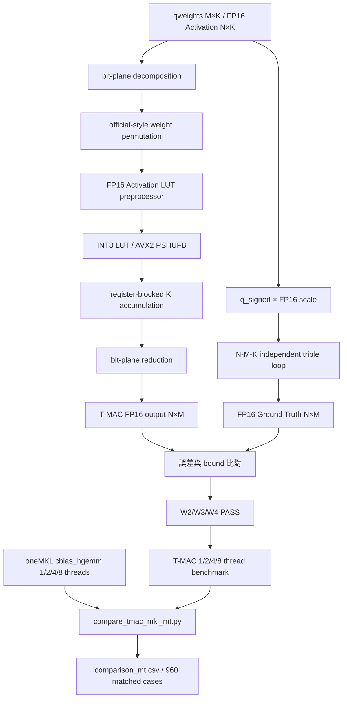

# T-MAC W2/W3/W4A16 正確性驗證與 oneMKL FP16 GEMM 多執行緒效能比較報告

本專案實作 T-MAC 的低位元查表矩陣乘法，使用真正的 FP16 Activation、AVX2/F16C、INT8 Lookup Table、官方 `bm/bn/kfactor` 候選排程與 OpenMP 多執行緒，並與 oneMKL FP16 GEMM 比較相同矩陣尺寸下的延遲差異。

驗證與效能測試分成兩條獨立流程：

1. `verify_tmac_gemm_independent.cpp`：以直接量化矩陣乘法 Ground Truth 驗證 packed weight、LUT、bit-plane reduction、schedule candidate、執行緒一致性及 optimized/reference kernel。
2. `t_mac_gemm_w234.cpp`、`mkl_fp16_gemm_mt.cpp` 與 `compare_tmac_mkl_mt.py`：比較 W2A16、W3A16、W4A16 與 oneMKL W16A16 在 1、2、4、8 thread budget 下的效能。

---

## 1. 測試架構總覽

### 定位

建立一套同時涵蓋「真實 FP16 輸入」、「官方風格資料排列與 tiling」、「獨立數學驗證」及「單／多執行緒效能比較」的 T-MAC GEMM 測試流程。

### 核心程式

| 程式 | 定位 | 驗證或測試內容 |
| :--- | :--- | :--- |
| `tmac_official_avx2.hpp` | T-MAC 核心 | FP16、LUT、weight packing、scale packing、reference kernel、register-blocked AVX2 kernel 與 OpenMP |
| `verify_tmac_gemm_independent.cpp` | 獨立數學驗證 | T-MAC 對直接量化矩陣乘法 Ground Truth，並驗證 packing、schedule 與 thread determinism |
| `t_mac_gemm_w234.cpp` | T-MAC 效能測試 | W2A16、W3A16、W4A16，官方候選 schedule、offline autotune、median latency 與 P90 |
| `mkl_fp16_gemm_mt.cpp` | Dense baseline | oneMKL `cblas_hgemm` W16A16 FP16 GEMM |
| `compare_tmac_mkl_mt.py` | 自動比較工具 | 配對相同 bit、M、K、N、threads，計算 speedup 並輸出 CSV |

### 測試精度設定

| 實作 | 權重格式 | Activation | Weight Scale | Output |
| :--- | :---: | :---: | :---: | :---: |
| T-MAC W2A16 | Signed 2-bit | FP16 | FP16 / group 128 | FP16 |
| T-MAC W3A16 | Signed 3-bit | FP16 | FP16 / group 128 | FP16 |
| T-MAC W4A16 | Signed 4-bit | FP16 | FP16 / group 128 | FP16 |
| oneMKL W16A16 | Dense FP16 | FP16 | 已合併至 FP16 weight | FP16 |

T-MAC 與 oneMKL 由相同 deterministic seed 產生同一組 `qweights`、FP16 Activation 與 FP16 group scale。oneMKL baseline 先將低位元權重依 group scale 解量化為 FP16 dense weight，再執行 `cblas_hgemm`。

> T-MAC 的 GFLOPS 以 `2 × M × K × N` 換算，代表完成相同 logical GEMM 的等效 throughput，不等於處理器實際執行的 FP16 FMA 數量。跨實作比較時應優先觀察 latency 與 speedup。

---

## 2. T-MAC GEMM 核心設計

### 矩陣語意

```text
Activation A : [N, K]
Quantized W  : [M, K]
Output C     : [N, M]
```

`M` 為 logical output channel。每個權重先拆成 `Bits` 個 bit-plane，內部 expanded channel 為：

```cpp
M_expanded = M * Bits;
```

完成 LUT accumulation 後，再將 bit-plane 合併為真正的 `C[N,M]`。

### Signed quantized weight

```cpp
q_signed = q_uint - (1 << (Bits - 1));
```

| 格式 | q_uint | q_signed |
| :---: | :---: | :---: |
| W2 | 0～3 | -2～1 |
| W3 | 0～7 | -4～3 |
| W4 | 0～15 | -8～7 |

### FP16 Activation 與 LUT

Activation 以 IEEE FP16 bit pattern 儲存。AVX2 kernel 使用 F16C 將 FP16 轉為 FP32 register，再建立 INT8 LUT：

```text
FP16 Activation
→ F16C 轉為 FP32
→ g=4 的 16-entry LUT
→ LUT 動態量化為 INT8
→ PSHUFB 查表
→ INT16 widening accumulation
→ FP32 scale/bias 與 bit-plane reduction
→ FP16 output
```

主要參數：

```text
g = 4
act_group_size = 64
weight_group_size = 128
LUT dtype = INT8
Activation / weight scale / output = FP16
```

### Bit-plane 合併與 bias

令 `s_i = 2b_i - 1`，則：

```text
q_signed = Σ 2^(i-1)s_i - 0.5
A·q_signed = Σ 2^(i-1)(A·s_i) - 0.5ΣA
```

各 bit-plane 的合併係數為：

| Plane | α |
| :---: | :---: |
| bit 0 | 0.5 |
| bit 1 | 1.0 |
| bit 2 | 2.0 |
| bit 3 | 4.0 |

`lut_bias=-ΣA` 僅加入 bit 0，再乘上 `alpha0=0.5`，得到 signed quantized weight 所需的 `-0.5ΣA`。

### 官方風格 Tiling 與 Weight Permutation

實作使用官方 `qgemm.py` 的 schedule candidate 概念：

```text
W2/W4 bm：128、256、512、1024
W3 bm：192、384、768
bn：8、16、32、64
kfactor：16
```

權重在計算前依 `bm/kfactor/SIMD/bit-plane` 順序離線 permutation。執行時以 `bm`、`bn` 切分 M/N，K 軸以 `kfactor × g = 64` 為 lookup reduction 單位。

核心 micro-kernel 每次處理 32 個 expanded outputs，使用 4 個 `__m256` accumulator 將完整 K reduction 保留在 register，所有 K 完成後才寫回並執行 bit-plane reduction。

### 多執行緒分派

多執行緒由 OpenMP 平行化外層 N tile 或 M tile。當可用 tile 數少於要求的 thread 數時：

```text
active_threads = min(requested_threads, parallel_work_items)
```

因此 `threads=8` 表示最多允許 8 個執行緒。960 組配對結果中有 47 組因 tile 數量限制使用 2 或 4 個 active threads；其餘 913 組使用完整要求數量。比較腳本會對這些案例輸出 Warning，避免將 requested threads 與 active threads 混為一談。

---

## 3. 正確性驗證

### 獨立資料路徑

`verify_tmac_gemm_independent.cpp` 使用同一組量化權重與 FP16 Activation 建立兩條獨立路徑：

```text
qweights[M,K]
   ├── bit-plane decomposition
   │   → official-style packing
   │   → INT8 LUT
   │   → AVX2 register-blocked kernel
   │   → bit-plane reduction
   │   → T-MAC output[N,M]
   │
   └── q_signed = q_uint - 2^(Bits-1)
       → 直接 N×M×K 三層迴圈
       → FP16 Ground Truth[N,M]
```

Ground Truth 不使用 packed weight、LUT、layout index、LUT scale/bias 或 reduction 函式，因此能降低兩條路徑共同使用相同錯誤邏輯的風險。

### 驗證內容

* 真實 FP16 Activation、FP16 group scale 與 FP16 output。
* 一般隨機輸入、零 Activation、正負固定 Activation、交錯極值權重與不同 scale。
* `packing=PASS`：packed weight 可逐 bit 還原原始權重。
* `thread_mismatches=0`：不同執行緒數輸出一致。
* `kernel_mismatches=0`：optimized register-blocked kernel 與 reference kernel 輸出一致。
* 所有官方有效 `bm/bn/kfactor` candidate 均執行 schedule regression。
* 依實際量化 LUT residual、FP16 scale/bias rounding 與 FP16 output rounding 建立誤差上界。

```text
max_bound_ratio = 實際誤差 / 理論容忍上界
```

只要 `max_bound_ratio < 1`，代表誤差未超過預估量化與 FP16 rounding 上界。

---

## 4. 獨立 GEMM 驗證結果

### 4.1 W2A16

| Shape | Mismatches | Max Abs Error | Mean Abs Error | Max Bound Ratio |
| :--- |  :---: | ---: | ---: | ---: |
| `256×256×1` | 0/256 | 0.0185547 | 0.0037440 | 0.175277 |
| `256×256×3` | 0/768 | 0.0170898 | 0.0040253 | 0.186119 |
| `512×512×8` | 0/4096 | 0.0317383 | 0.0061373 | 0.165129 |
| `1024×1024×16` | 0/16384 | 0.0527344 | 0.0089259 | 0.138297 |
| `1024×2048×3` | 0/3072 | 0.0664062 | 0.0128244 | 0.087222 |
| `2048×1024×8` | 0/16384 | 0.0502930 | 0.0088625 | 0.143781 |

### 4.2 W3A16

| Shape | Mismatches | Max Abs Error | Mean Abs Error | Max Bound Ratio |
| :--- |  :---: | ---: | ---: | ---: |
| `256×256×1` | 0/256 | 0.0371094 | 0.0076674 | 0.191820 |
| `256×256×3` | 0/768 | 0.0468750 | 0.0087150 | 0.194412 |
| `512×512×8` | 0/4096 | 0.0639648 | 0.0125061 | 0.146320 |
| `1024×1024×16` | 0/16384 | 0.1035156 | 0.0185057 | 0.130169 |
| `1024×2048×3` | 0/3072 | 0.1181641 | 0.0258893 | 0.071195 |
| `2048×1024×8` | 0/16384 | 0.1015625 | 0.0182557 | 0.110105 |

### 4.3 W4A16

| Shape | Mismatches | Max Abs Error | Mean Abs Error | Max Bound Ratio |
| :--- |  :---: | ---: | ---: | ---: |
| `256×256×1` | 0/256 | 0.0703125 | 0.0156141 | 0.135683 |
| `256×256×3` | 0/768 | 0.0937500 | 0.0172345 | 0.208138 |
| `512×512×8` | 0/4096 | 0.1503906 | 0.0251053 | 0.166362 |
| `1024×1024×16` | 0/16384 | 0.2421875 | 0.0370468 | 0.122323 |
| `1024×2048×3` | 0/3072 | 0.2578125 | 0.0523770 | 0.068848 |
| `2048×1024×8` | 0/16384 | 0.2089844 | 0.0367069 | 0.118889 |

### 4.4 驗證總結

| Bit-width | Numerical Cases | Outputs | Mismatches | Thread Mismatches | Kernel Mismatches | Schedule Cases | 最大 Bound Ratio | Result |
| :---: | :---: | ---: | ---: | ---: | ---: | :---: | ---: | :---: |
| W2 | 12 | 45,568 | 0 | 0 | 0 | 12 | 0.189461 | PASS |
| W3 | 12 | 45,568 | 0 | 0 | 0 | 12 | 0.202234 | PASS |
| W4 | 12 | 45,568 | 0 | 0 | 0 | 16 | 0.208138 | PASS |
| **Total** | **36** | **136,704** | **0** | **0** | **0** | **40** | **0.208138** | **PASS** |

> <mark><strong>驗證結果：W2、W3、W4 全部 PASS；136,704 個 output 與 40 組 schedule candidate 均無 mismatch。</strong></mark>

### 結果分析

* 36 組數值案例、136,704 個 output 全部通過，沒有 mismatch。
* 40 組官方 schedule candidate regression 全部通過。
* 最大 `max_bound_ratio` 為 0.208138，遠低於 1。
* W2、W3、W4 的誤差隨 bit-plane 加權總和增加而逐步上升，符合 INT8 LUT quantization、FP16 scale/bias 與 output rounding 的預期。
* `thread_mismatches=0` 證明 OpenMP tile 分派沒有 race condition 造成的輸出差異。
* `kernel_mismatches=0` 證明 register-blocked optimized kernel 與 reference accumulation 路徑一致。

---

## 5. 效能測試設計

### Batch Size

| N | 對應情境 |
| :---: | :--- |
| 1 | Decode / 單 token GEMV-like GEMM |
| 8 | 小 batch / 小型 prefill |
| 32 | 中型 prefill |
| 128 | 大 batch GEMM |
| 512 | 高重用 batched GEMM |

### Matrix Shape

| 分類 | 測試矩陣 |
| :--- | :--- |
| Square GEMM | 1024×1024、2048×2048、4096×4096、8192×8192 |
| K Expansion | 1024×4096、2048×8192、4096×11008、4096×14336 |
| M Expansion | 4096×1024、8192×2048、11008×4096、14336×4096 |
| Medium Asymmetric | 1024×2048、2048×1024、2048×4096、4096×2048 |

每個 bit-width 包含：

```text
4 categories × 4 shapes × 5 batch sizes × 4 thread budgets = 320 cases
```

W2、W3、W4 合計 960 組 T-MAC／oneMKL 配對結果。

### 計時方法

每組正式測量前執行 3 次 warm-up。依 logical FLOPs 決定 sample 數：

```text
FLOPs < 1e8   ：21 samples
FLOPs < 1e9   ：11 samples
FLOPs < 1e10  ：7 samples
其他          ：5 samples
```

最終 latency 使用 sample median，並額外記錄 P90。T-MAC 的 `preprocess_ms` 包含 FP16 Activation LUT 建立，`kernel_ms` 為查表與 output reduction；`total_ms` 為兩者合計。

### Offline Autotune

每個 `bit × M × K × N × requested_threads` 都測試所有有效官方 schedule candidates，使用候選 latency 的 median 選擇 `bm/bn/kfactor`。`tuning_ms` 為離線調優成本，不計入正式 `total_ms`。

---

## 6. T-MAC 與 oneMKL 效能結果

### 6.1 整體結果

| Bit | Threads | Cases | T-MAC Faster | Median Speedup | Geomean Speedup |
| :---: | :---: | :---: | :---: | ---: | ---: |
| W2 | 1 | 80 | 50/80 | 1.551× | 1.581× |
| W2 | 2 | 80 | 66/80 | 3.088× | 2.841× |
| W2 | 4 | 80 | 72/80 | 2.268× | 2.739× |
| W2 | 8 | 80 | 70/80 | 2.257× | 2.518× |
| W3 | 1 | 80 | 47/80 | 1.234× | 1.179× |
| W3 | 2 | 80 | 55/80 | 2.492× | 2.086× |
| W3 | 4 | 80 | 65/80 | 1.698× | 2.240× |
| W3 | 8 | 80 | 66/80 | 1.820× | 2.112× |
| W4 | 1 | 80 | 33/80 | 0.895× | 0.749× |
| W4 | 2 | 80 | 50/80 | 1.816× | 1.499× |
| W4 | 4 | 80 | 59/80 | 1.200× | 1.675× |
| W4 | 8 | 80 | 53/80 | 1.507× | 1.800× |

> <mark><strong>整體效能順序為 W2A16 ＞ W3A16 ＞ W4A16；其中 W2A16 在所有 thread budget 下的 geomean 均高於 oneMKL。</strong></mark>

整體結果顯示：

* W2A16 效能最穩定，所有 thread budget 的 geomean 均高於 oneMKL；2 threads 為 2.841×，4 threads 為 2.739×。
* W3A16 單執行緒 geomean 為 1.179×，多執行緒提升至 2.086×～2.240×。
* W4A16 單執行緒 geomean 為 0.749×，但 2、4、8 thread budget 分別提升至 1.499×、1.675×、1.800×。
* bit-width 增加時需要處理更多 bit-plane，因此 W2 → W3 → W4 的整體優勢依序下降。
* 多執行緒下 T-MAC 的勝率明顯增加，W2 在 4 threads 時有 72/80 組快於 oneMKL，W3 在 8-thread budget 時有 66/80 組較快。

### 6.2 不同 Batch Size

| Bit | Threads | N=1 | N=8 | N=32 | N=128 | N=512 |
| :---: | :---: | ---: | ---: | ---: | ---: | ---: |
| W2 | 1 | 4.692× | 5.827× | 1.591× | 0.698× | 0.326× |
| W2 | 2 | 4.375× | 11.048× | 3.161× | 1.616× | 0.750× |
| W2 | 4 | 2.488× | 8.505× | 3.771× | 1.903× | 1.016× |
| W2 | 8 | 1.023× | 7.940× | 4.917× | 2.053× | 1.234× |
| W3 | 1 | 3.752× | 4.151× | 1.364× | 0.518× | 0.207× |
| W3 | 2 | 3.485× | 8.375× | 2.779× | 1.002× | 0.486× |
| W3 | 4 | 2.214× | 7.253× | 3.221× | 1.380× | 0.791× |
| W3 | 8 | 1.572× | 5.763× | 3.279× | 1.514× | 0.935× |
| W4 | 1 | 1.973× | 2.862× | 0.922× | 0.295× | 0.153× |
| W4 | 2 | 2.462× | 6.295× | 2.070× | 0.689× | 0.342× |
| W4 | 4 | 1.231× | 6.286× | 2.534× | 1.080× | 0.623× |
| W4 | 8 | 1.079× | 6.415× | 3.262× | 1.159× | 0.722× |

> <mark><strong>最有利的 batch 範圍為 N=1～8；當 N 增加至 128～512，oneMKL 的 dense GEMM 資料重用優勢逐步增加。</strong></mark>

主要趨勢：

* N=1 與 N=8 是低位元 LUT kernel 最具優勢的範圍。單執行緒 W2 在 N=1、N=8 的 geomean 分別為 4.692×、5.827×。
* N=32 時，W2/W3 在所有 thread budget 下仍有優勢；W4 單執行緒接近交叉點，多執行緒後重新超過 oneMKL。
* N=128 時，W2 在 2～8 thread budget 下仍有 1.616×～2.053×；W3/W4 需要 4 threads 以上才較穩定超過 oneMKL。
* N=512 時，oneMKL 的 dense GEMM blocking 與資料重用優勢增加。W2 在 4～8 thread budget 接近或超過 oneMKL，W3/W4 整體仍較弱。
* 8-thread budget 在 N=1 的結果較不穩定，原因是部分 shape 可平行 tile 不足，以及異質核心與 OpenMP 排程成本；因此不呈現單調 thread scaling。

### 6.3 不同矩陣類型

| Bit | Threads | Square | K Expansion | M Expansion | Medium Asymmetric |
| :---: | :---: | ---: | ---: | ---: | ---: |
| W2 | 1 | 1.583× | 1.397× | 1.453× | 1.945× |
| W2 | 2 | 2.733× | 2.688× | 2.798× | 3.171× |
| W2 | 4 | 2.834× | 2.553× | 2.900× | 2.683× |
| W2 | 8 | 2.363× | 3.671× | 2.643× | 1.753× |
| W3 | 1 | 1.137× | 1.051× | 1.122× | 1.440× |
| W3 | 2 | 1.985× | 1.844× | 2.008× | 2.575× |
| W3 | 4 | 2.144× | 1.961× | 2.385× | 2.513× |
| W3 | 8 | 1.589× | 2.790× | 2.396× | 1.874× |
| W4 | 1 | 0.961× | 0.603× | 0.635× | 0.855× |
| W4 | 2 | 1.742× | 1.264× | 1.343× | 1.708× |
| W4 | 4 | 2.249× | 1.370× | 1.595× | 1.602× |
| W4 | 8 | 2.133× | 1.982× | 1.491× | 1.664× |

矩陣類型並未改變整體 bit-width 次序：

```text
W2 > W3 > W4
```

W2 在各 category 與各 thread budget 下均具有整體優勢。W3 單執行緒在四類矩陣中仍略快於 oneMKL，W4 單執行緒則在 K/M Expansion 與 Medium Asymmetric 較弱；當使用 2 threads 以上後，W4 的四類 geomean 均提升至 1× 以上。

### 6.4 多執行緒擴充性

以下為各實作相對自身單執行緒 latency 的 geomean scaling：

| Bit | T-MAC 2T | T-MAC 4T | T-MAC 8T | MKL 2T | MKL 4T | MKL 8T |
| :---: | ---: | ---: | ---: | ---: | ---: | ---: |
| W2 | 2.024× | 2.267× | 1.985× | 1.126× | 1.309× | 1.247× |
| W3 | 2.132× | 2.540× | 2.200× | 1.205× | 1.337× | 1.228× |
| W4 | 2.326× | 2.909× | 2.905× | 1.162× | 1.301× | 1.209× |

> <mark><strong>整體較穩定的平行區間為 2～4 threads；8-thread budget 不保證所有 shape 都能持續加速。</strong></mark>

結果顯示：

* T-MAC 在 2 threads 時約有 2.02×～2.33× scaling，4 threads 時約有 2.27×～2.91×。
* W2/W3 在 4 threads 達到較佳整體平衡；8-thread budget 受到 active thread 數與異質核心排程影響，未必持續提升。
* W4 的工作量較大，較能攤平 thread 啟動成本，因此 4 與 8 thread budget 的 scaling 接近。
* 此測試中 oneMKL FP16 GEMM 的整體 thread scaling 約為 1.1×～1.34×，因此 T-MAC 在多執行緒比較中的相對優勢高於單執行緒。

### 6.5 與 T-MAC 官方論文及程式方向對照

本結果與官方論文及 repository 的主要趨勢大致一致：

1. **低 bit-width 優勢較大**：官方指出 LUT kernel 的計算量與 latency 會隨 weight bit-width 近似線性擴張。本測試中所有 thread budget 均呈現 W2 最佳、W3 次之、W4 最弱。
2. **Decode 與小 batch 具有明顯優勢**：N=1 與 N=8 的 geomean 普遍高於 N=128、N=512，符合低位元權重讀取與直接 LUT mpGEMM 在低重用場景的優勢。
3. **多執行緒能提高整體 throughput**：T-MAC 在 2～4 threads 有穩定 scaling，多數 W2/W3/W4 案例在多執行緒下超過 oneMKL。
4. **效能高度依賴硬體與 shape**：官方 repository 亦指出 x86 CPU 的記憶體頻寬與架構差異很大，特別是 4-bit 不保證在所有 x86 平台都有顯著加速。本測試的 W4 單執行緒 geomean 低於 1，與此限制相符。

本測試 baseline 為 oneMKL FP16 GEMM，官方論文主要比較 llama.cpp、OpenBLAS 或端到端模型推論；CPU、編譯器、kernel generation 與測試情境也不同，因此只能比較整體趨勢，不能直接對照絕對 speedup 數值。

官方資料：

* [T-MAC Paper：CPU Renaissance via Table Lookup for Low-Bit LLM Deployment on Edge](https://arxiv.org/abs/2407.00088)
* [Microsoft T-MAC Official Repository](https://github.com/microsoft/T-MAC)

---

## 7. 編譯與執行

### 7.1 T-MAC 與 Independent Verifier

```bash
g++ -O3 -std=c++17 -mavx2 -mfma -mf16c -fopenmp \
    -Wall -Wextra -Wpedantic \
    t_mac_gemm_w234.cpp -o t_mac_gemm_w234

g++ -O2 -std=c++17 -mavx2 -mfma -mf16c -fopenmp \
    -Wall -Wextra -Wpedantic \
    verify_tmac_gemm_independent.cpp \
    -o verify_tmac_gemm_independent
```

```bash
./verify_tmac_gemm_independent | tee verify_tmac_gemm_independent.log
```

預期：

```text
packing=PASS
thread_mismatches=0
kernel_mismatches=0
FINAL W2=PASS W3=PASS W4=PASS
```

### 7.2 OpenMP 設定

```bash
export OMP_DYNAMIC=FALSE
export OMP_PROC_BIND=close
export OMP_PLACES=cores
export OMP_WAIT_POLICY=ACTIVE
```

### 7.3 T-MAC Benchmark

```bash
./t_mac_gemm_w234 \
    --threads 1,2,4,8 \
    --autotune \
    | tee tmac_fp16_mt.log
```

### 7.4 oneMKL Benchmark

```bash
source /opt/intel/oneapi/setvars.sh

g++ -O3 -std=c++17 -mavx2 -mfma -mf16c -fopenmp \
    mkl_fp16_gemm_mt.cpp \
    -I${MKLROOT}/include \
    -L${MKLROOT}/lib/intel64 \
    -Wl,--no-as-needed \
    -lmkl_intel_lp64 \
    -lmkl_gnu_thread \
    -lmkl_core \
    -lgomp -lpthread -lm -ldl \
    -o mkl_fp16_gemm_mt
```

```bash
./mkl_fp16_gemm_mt --threads 1,2,4,8 | tee mkl_fp16_mt.log
```

### 7.5 結果配對

```bash
python3 -m py_compile compare_tmac_mkl_mt.py

python3 compare_tmac_mkl_mt.py \
    --tmac-log tmac_fp16_mt.log \
    --mkl-log mkl_fp16_mt.log \
    --output comparison_mt.csv
```

預期配對數：

```text
Matched cases: 960
```

---

## 8. 系統驗證工作流



---

## 9. 結果解讀與使用限制

> <mark><strong>本報告的數據應解讀為：完成離線準備與調優後的 GEMM operator latency，而不是完整 LLM 推論速度。</strong></mark>

### 9.1 Thread Budget 與實際執行緒數

報告中的 `threads` 代表允許使用的最大執行緒數，實際執行量由可平行的 N tile 或 M tile 數量決定：

```text
active_threads = min(requested_threads, parallel_work_items)
```

960 組案例中有 47 組的 `active_threads` 少於 requested threads，因此第 6.4 節應解讀為 **thread budget scaling**。若要嚴格比較固定執行緒數，應另外篩選：

```text
active_threads == requested_threads
```

### 9.2 計時範圍

正式 T-MAC latency 為：

```text
total_ms = preprocess_ms + kernel_ms
```

其中包含 FP16 Activation LUT 建立、查表、累加與 output reduction；不包含離線 weight packing、oneMKL 權重解量化、記憶體配置與 `tuning_ms`。因此結果代表 schedule 已選定後的重複執行效能，而不是第一次執行的總等待時間。

### 9.3 統計值與穩定性

- Median：代表典型 latency。
- P90：反映較差情況下的延遲與排程波動。
- Geomean：適合彙整不同矩陣尺寸的整體 speedup。
- Faster cases：顯示多少個別案例快於 oneMKL。

判讀時應同時觀察這四項。若 P90 明顯高於 median，代表該 shape 或 thread 設定較容易受到 WSL、OpenMP、CPU frequency、異質核心或背景程序影響。

### 9.4 比較公平性與結果邊界

T-MAC 與 oneMKL 使用相同的 FP16 Activation、low-bit `qweights` 與 FP16 group scale；oneMKL 的權重會在離線階段解量化為 dense FP16，再執行 `cblas_hgemm`。

因此本測試比較的是：

> 直接使用低位元 LUT GEMM，與先解量化成 dense FP16 再使用 oneMKL GEMM 的 operator latency。

T-MAC GFLOPS 使用 `2 × M × K × N / latency` 計算，是 logical equivalent GFLOPS，不代表實際 FP16 FMA 指令數。結果也不能直接換算成完整模型的 tokens/s。

### 9.5 與官方實作及測試環境的關係

本實作對齊官方的 FP16 Activation、W2/W3/W4 bit-plane、INT8 LUT、`bm/bn/kfactor`、weight permutation 與外層 tile 平行化方向；但不是官方 TVM／AutoTVM／LLVM generated kernel 的逐指令複製。

效能也會受到 CPU、Cache、memory bandwidth、OpenMP runtime、WSL、電源模式與 oneMKL 版本影響。移植至其他平台時，應重新執行 verifier、autotune 與 benchmark，不應直接沿用本報告的最佳 schedule 或 speedup。

> <mark><strong>最可靠的結果範圍：低 bit-width、N=1～32 與適當 thread budget 是 T-MAC 最有利的使用情境；W2A16 的優勢最穩定。</strong></mark>

---

## 10. 結論

本專案完成 T-MAC W2A16、W3A16、W4A16 的 standalone AVX2/F16C/OpenMP GEMM 實作，並對齊官方低位元 LUT compute、bit-plane decomposition、`bm/bn/kfactor` schedule candidate、離線 weight permutation 與多執行緒外層 tile 分派。

正確性方面：

* 36 組數值案例、136,704 個 FP16 output 全部通過。
* W2、W3、W4 的 packing、Ground Truth、thread determinism 與 optimized/reference kernel 全部為 0 mismatch。
* 40 組 schedule candidate regression 全部 PASS。
* 最大 `max_bound_ratio` 為 0.208138，所有誤差均在量化與 FP16 rounding 上界內。

效能方面：

* W2A16 在 1／2／4／8 thread budget 的 geomean speedup 分別為 1.581×、2.841×、2.739×、2.518×。
* W3A16 分別為 1.179×、2.086×、2.240×、2.112×。
* W4A16 分別為 0.749×、1.499×、1.675×、1.800×。
* W2 的整體效能與勝率最高，W3 次之，W4 因 bit-plane 數量增加而較接近或低於 dense FP16 baseline。
* T-MAC 的主要優勢集中於 N=1～32；N 增加至 128～512 後，oneMKL 的 dense blocking 與資料重用優勢逐步增加。
* 2～4 threads 是整體較穩定的平行區間；8-thread budget 會受到 active tile 數量、OpenMP 排程與異質核心影響，並非所有 shape 都能使用完整 8 threads。

因此可得到以下結論：

> <mark><strong>最終結論：T-MAC 最適合低 bit-width、Decode／小 batch 與適當的 2～4 thread budget，其中 W2A16 的效能優勢最穩定。</strong></mark>
>
> 在真正 FP16 Activation 與低位元權重下，T-MAC 能透過 INT8 LUT、bit-wise accumulation 與官方風格 tiling 降低 mixed-precision GEMM 成本；大 batch 與高 bit-width 的效能則更依賴矩陣 shape、CPU 架構與 schedule 選擇。


---

# Appendix A：Benchmark Configuration

為了確保 benchmark 具有可重現性（Reproducibility），本研究所有 T-MAC 與 oneMKL 測試皆使用相同硬體環境、相同矩陣尺寸與相同測試流程。

| 項目 | 設定 |
| :--- | :--- |
| CPU | Intel Core Ultra 7 258V |
| ISA | AVX2、FMA、F16C |
| OS | Ubuntu 24.04 (WSL2) |
| Compiler | g++ (`-O3 -march=native -mavx2 -mfma -mf16c`) |
| BLAS | Intel oneMKL (`cblas_hgemm`) |
| Activation | FP16 |
| Weight | W2A16、W3A16、W4A16 |
| Thread Budget | 1、2、4、8 |
| Random Seed | 42 |
| Metrics | Latency、Equivalent GFLOPS、Speedup、Median、Geometric Mean |

## Benchmark 原則

- T-MAC 與 oneMKL 使用相同 M、K、N。
- 使用相同 FP16 Activation。
- oneMKL 使用由相同低位元權重還原之 FP16 Dense Weight。
- Latency 不包含 Packing、Auto-tuning、記憶體配置等離線成本。
- Speedup = MKL Latency / T-MAC Latency。

## Benchmark 解讀

建議依序閱讀：

1. Independent Verification 是否全部 PASS。
2. Latency（主要比較依據）。
3. Speedup。
4. Geometric Mean（整體趨勢）。
5. Median 與 P90（穩定性）。

Equivalent GFLOPS 僅作為吞吐量指標，不代表實際執行的浮點運算數。
