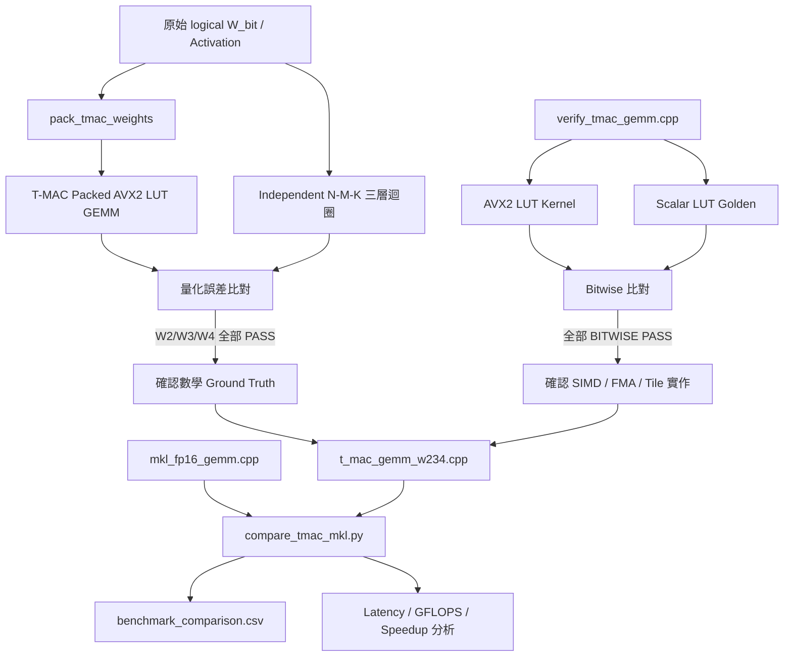

# T-MAC W2/W3/W4 正確性驗證與 oneMKL FP16 GEMM 效能比較報告

本專案旨在實作並驗證 T-MAC 的低位元查表矩陣乘法，並比較 T-MAC W2A16、W3A16、W4A16 與 oneMKL FP16 GEMM 在相同矩陣尺寸及單執行緒環境下的效能差異。

為避免高效能核心與驗證程式共用相同中間資料或位址公式，造成「兩邊一起算錯卻仍通過」的同源錯誤風險，本專案將驗證拆成兩個層次：

1. `verify_tmac_gemm.cpp`：AVX2 LUT kernel 與純量 LUT 模擬器的 Bitwise 驗證。
2. `verify_tmac_gemm_independent.cpp`：T-MAC packed/LUT GEMM 與原始 `W_bit` 三層迴圈 Ground Truth 的獨立數學驗證。

正確性確認後，再使用 `t_mac_gemm_w234.cpp`、`mkl_fp16_gemm.cpp` 與 `compare_tmac_mkl.py` 完成完整效能比較。

---

## 1. 測試架構總覽

### 定位

建立一套同時涵蓋「指令級正確性」、「數學等價性」與「效能比較」的 T-MAC GEMM 驗證流程。

### 核心程式

| 程式 | 定位 | 驗證或測試內容 |
| :--- | :--- | :--- |
| `verify_tmac_gemm.cpp` | 指令級驗證 | AVX2 LUT kernel 對 Scalar LUT Golden Reference |
| `verify_tmac_gemm_independent.cpp` | 獨立數學驗證 | Packed/LUT T-MAC 對原始 `W_bit` 三層迴圈 |
| `t_mac_gemm_w234.cpp` | T-MAC 效能測試 | W2A16、W3A16、W4A16 latency 與等效 GFLOPS |
| `mkl_fp16_gemm.cpp` | Dense baseline | oneMKL W16A16 FP16 GEMM latency 與 GFLOPS |
| `compare_tmac_mkl.py` | 自動比較工具 | 配對相同 M/K/N，計算 speedup 並輸出 CSV |

### 測試精度設定

| 實作 | 權重格式 | Activation | 主要用途 |
| :--- | :---: | :---: | :--- |
| T-MAC W2A16 | 2-bit-plane 分組 | FP32 建立 INT8 LUT | 低位元查表 GEMM |
| T-MAC W3A16 | 3-bit-plane 分組 | FP32 建立 INT8 LUT | 低位元查表 GEMM |
| T-MAC W4A16 | 4-bit-plane 分組 | FP32 建立 INT8 LUT | 低位元查表 GEMM |
| oneMKL W16A16 | Dense FP16 | FP16 | 標準 dense GEMM baseline |

> T-MAC 的 GFLOPS 使用 `2 × M × K × N` 換算，代表「等效 GEMM throughput」，不等於處理器實際執行的 FP16 浮點指令數。因此跨實作比較時，應優先觀察 latency 與 latency speedup。

---

## 2. T-MAC GEMM 核心設計

### 定位

`t_mac_gemm_w234.cpp` 將 W2、W3、W4 合併成同一套 template kernel，確保三種 bit-width 使用相同的測試尺寸、資料生成、計時方式與輸出格式。

### 核心流程

1. 為每個 batch activation 建立獨立 LUT。
2. 將 LUT 動態量化為 INT8。
3. 使用 `_mm256_shuffle_epi8` 進行暫存器查表。
4. 使用 INT16 widening accumulation 聚合查表結果。
5. 使用 `_mm256_fmadd_ps` 套用 LUT scale、bias 與 weight scale。
6. 依 `M_BLOCK=512` 進行 M 維度 tiling。
7. 以 global bit-plane index 處理 W3 跨 tile phase。

### Global Bit-plane 修正

原本只使用 tile 內部索引：

```cpp
(i / 4) % Bits
```

在 W3 且 `M_BLOCK=512` 時會產生問題：

```text
512 / 8 = 64
64 mod 3 = 1
```

第二個 tile 的 bit-plane phase 應從 1 開始，不能重新從 0 開始。因此新版使用：

```cpp
const int bit_plane_base = m_start / 8;

const int ib0 = bit_plane_base + i / 4;
const int ib1 = ib0 + 1;
const int ib2 = ib0 + 2;
const int ib3 = ib0 + 3;
```

此修正同時適用於 W2、W3、W4，使 kernel 不再依賴 tile 大小剛好對齊 bit-width。

---

## 3. 第一層驗證：AVX2 與 Scalar LUT Bitwise 驗證

### 定位

`verify_tmac_gemm.cpp` 用來確認 AVX2 kernel 是否忠實執行同一套 LUT 定義與位址映射。

### 驗證方法

* AVX2 與 Scalar 版本使用相同 packed weights、qlut、lut scale 與 lut bias。
* Scalar Golden Reference 以純量陣列模擬 AVX2 lane。
* 使用 `std::fma()` 模擬 `_mm256_fmadd_ps` 的一次性捨入。
* `kk==0` 時直接覆蓋 accumulator，後續 group 才進行加法累積。
* 編譯加入 `-ffp-contract=off`，避免編譯器把其他乘加自動融合。
* 比較每一個 FP32 output 的 32-bit pattern。

### 驗證結果

W2、W3、W4 全部達成：

```text
BITWISE PASS
```

### 這份驗證證明了什麼

* `_mm256_shuffle_epi8` 查表行為正確。
* 高低 nibble 拆分正確。
* INT8 → INT16 → INT32 widening accumulation 正確。
* `_mm256_fmadd_ps`、乘法與加法順序正確。
* M tiling、weight offset、output offset 正確。
* W3 global bit-plane phase 已正確套用。
* Scalar LUT 與 AVX2 LUT kernel 在 bit pattern 上完全一致。

### 驗證限制

這一層仍共用：

```text
qlut_all
lut_scales_all
lut_biases_all
```

因此它主要證明「AVX2 kernel 與 Scalar LUT 模擬器一致」，不能單獨證明 LUT 建表、權重打包及查表公式在數學上等價於原始矩陣乘法。

---

## 4. 第二層驗證：獨立三層迴圈 GEMM Ground Truth

### 定位

`verify_tmac_gemm_independent.cpp` 不使用 qlut 作為 Golden Reference，而是從原始未壓縮的 `W_bit` 出發，分成兩條獨立資料路徑：

```text
原始 W_bit
   ├── pack_tmac_weights → T-MAC packed/LUT GEMM
   └── N × M × K 純三層迴圈 → Independent Ground Truth
```

此設計用來排除兩邊共用相同 LUT 或 packed layout 錯誤的風險。

### 測資生成

* 使用 `std::mt19937(seed=42)`，確保測試可重現。
* `W_bit[m][k]` 隨機產生 0 或 1。
* 數學權重映射：

```text
W_bit = 1 → +1
W_bit = 0 → -1
```

* Activation 範圍：

```text
[-0.1, 0.1]
```

* Weight scale 固定為：

```text
1.0
```

### T-MAC 路徑

1. 由原始 `W_bit[M×K]` 經 `pack_tmac_weights()` 轉換成 T-MAC 交錯格式。
2. 每 4 個 K 維度組成一個 4-bit LUT index。
3. 依 32-channel block 進行 lane 與 nibble 排列。
4. 每個 batch 獨立建立 LUT。
5. 執行 W2/W3/W4 T-MAC AVX2 GEMM。

### Independent Naive 路徑

Ground Truth 完全不使用：

```text
packed_weights
qlut
lut_scales_all
lut_biases_all
tbl_update_avx2
weight_offset
bit_plane_base
```

而是直接使用最單純的三層迴圈：

```cpp
for (int n = 0; n < N; ++n)
{
    for (int m = 0; m < M; ++m)
    {
        for (int k = 0; k < K; ++k)
        {
            output[n * M + m] +=
                logical_weight[m * K + k] *
                activation[n * K + k];
        }
    }
}
```

另外依獨立數學公式判斷：

```cpp
const int bit_plane = (m / 8) % Bits;
const bool gets_bias = (bit_plane == 0);
```

因此這條路徑能驗證：

* `pack_tmac_weights()` 是否正確。
* nibble index 是否正確對應四個 K 維度。
* W2/W3/W4 bit-plane 分組是否正確。
* batch activation offset 是否正確。
* batch output offset 是否正確。
* 每個 batch 是否使用自己的 LUT。
* M tiling 與跨 tile phase 是否正確。
* T-MAC 查表結果是否在量化誤差內等價於直接矩陣乘法。

---

## 5. 獨立 GEMM 驗證測資

### 測試尺寸

| Shape（M×K×N） | 驗證目的 |
| :--- | :--- |
| `256×256×1` | 基本 GEMV / GEMM 邏輯 |
| `256×256×3` | N>1、非 2 次方 batch |
| `512×512×2` | M_BLOCK 邊界 |
| `1024×1024×4` | 跨越兩個 M tile |
| `1024×2048×3` | K Expansion |
| `2048×1024×3` | M Expansion 與多個 tile |

### 比對指標

每一組測試輸出：

* `mismatches`
* `max_abs_err`
* `mean_abs_err`
* `RMSE`
* T-MAC 單次執行時間
* Naive 三層迴圈執行時間
* 最大誤差元素位置
* 前四個 output 數值

### 容忍度

```text
absolute tolerance = 0.08
relative tolerance = 0.02
```

逐元素判定：

```text
|T-MAC - Naive| <= 0.08 + 0.02 × |Naive|
```

此容忍度用來吸收 T-MAC INT8 LUT 動態量化造成的誤差，而不是 SIMD 與 Scalar 的 ULP 差異。

---

## 5-1. W2A16 獨立 GEMM 驗證結果

| Shape | Mismatches | Max Abs Error | Mean Abs Error | RMSE | T-MAC | Naive |
| :--- | :---: | ---: | ---: | ---: | ---: | ---: |
| `256×256×1` | 0/256 | 0.0146146 | 0.00422584 | 0.00524177 | 0.005383 ms | 0.478702 ms |
| `256×256×3` | 0/768 | 0.0171266 | 0.00455940 | 0.00569081 | 0.013832 ms | 1.50758 ms |
| `512×512×2` | 0/1024 | 0.0283976 | 0.00652202 | 0.00824566 | 0.025604 ms | 3.84120 ms |
| `1024×1024×4` | 0/4096 | 0.0453402 | 0.00926170 | 0.0115603 | 0.147235 ms | 33.0978 ms |
| `1024×2048×3` | 0/3072 | 0.0609264 | 0.0128743 | 0.0161699 | 0.202118 ms | 48.8335 ms |
| `2048×1024×3` | 0/6144 | 0.0461664 | 0.00919513 | 0.0115851 | 0.180045 ms | 45.9355 ms |

### 結果分析

W2 六組測資全部為 PASS

全部 output 均未超出容忍度。

隨 K 與矩陣規模增加，最大誤差與平均誤差逐漸上升，符合 LUT INT8 量化誤差會隨累加長度增加的預期。最大誤差出現在 `1024×2048×3`，為 0.0609264，仍低於設定的判定範圍。

---

## 5-2. W3A16 獨立 GEMM 驗證結果

| Shape | Mismatches | Max Abs Error | Mean Abs Error | RMSE | T-MAC | Naive |
| :--- | :---: | ---: | ---: | ---: | ---: | ---: |
| `256×256×1` | 0/256 | 0.0146146 | 0.00422584 | 0.00524177 | 0.005611 ms | 0.677698 ms |
| `256×256×3` | 0/768 | 0.0171266 | 0.00455940 | 0.00569081 | 0.011286 ms | 1.41900 ms |
| `512×512×2` | 0/1024 | 0.0283977 | 0.00652203 | 0.00824567 | 0.018415 ms | 3.56223 ms |
| `1024×1024×4` | 0/4096 | 0.0453399 | 0.00926170 | 0.0115603 | 0.159029 ms | 32.9088 ms |
| `1024×2048×3` | 0/3072 | 0.0609264 | 0.0128743 | 0.0161699 | 0.185891 ms | 43.0123 ms |
| `2048×1024×3` | 0/6144 | 0.0461664 | 0.00919513 | 0.0115851 | 0.157032 ms | 39.6314 ms |

### 結果分析

W3 六組測資全部為 PASS，且包含：

```text
M=1024
M=2048
```

因此實際跨越 `M_BLOCK=512` 的多個 tile。這代表 global bit-plane 修正不只在共用 qlut 的 Bitwise 驗證中成立，也在完全獨立的原始 `W_bit` 三層迴圈 Ground Truth 中通過。

W3 與 W2/W4 的誤差統計高度接近，表示三種 bit-plane 分組在相同 logical weights 與 activation 下，皆能保持一致的數學結果。

---

## 5-3. W4A16 獨立 GEMM 驗證結果

| Shape | Mismatches | Max Abs Error | Mean Abs Error | RMSE | T-MAC | Naive |
| :--- | :---: | ---: | ---: | ---: | ---: | ---: |
| `256×256×1` | 0/256 | 0.0146146 | 0.00422584 | 0.00524177 | 0.003848 ms | 0.425761 ms |
| `256×256×3` | 0/768 | 0.0171266 | 0.00455940 | 0.00569081 | 0.007681 ms | 1.21481 ms |
| `512×512×2` | 0/1024 | 0.0283976 | 0.00652202 | 0.00824566 | 0.015854 ms | 3.22159 ms |
| `1024×1024×4` | 0/4096 | 0.0453402 | 0.00926170 | 0.0115603 | 0.110622 ms | 26.3994 ms |
| `1024×2048×3` | 0/3072 | 0.0609264 | 0.0128743 | 0.0161699 | 0.160918 ms | 39.1637 ms |
| `2048×1024×3` | 0/6144 | 0.0461661 | 0.00919513 | 0.0115851 | 0.241806 ms | 40.4320 ms |

### 結果分析

W4 六組測資全部為 PASS。此結果延續先前 GEMV 獨立三層迴圈驗證，並新增：

* N>1 batched activation。
* Batched output stride。
* 每個 batch 獨立 LUT。
* M tiling。
* K Expansion 與 M Expansion。

因此 W4 已不只驗證單一 GEMV，而是進一步驗證 Batched GEMM 路徑。

---

## 6. 獨立 GEMM 驗證總結

| Bit-width | Cases | Total Outputs | Mismatches | Result |
| :---: | :---: | ---: | ---: | :---: |
| W2 | 6 | 15,360 | 0 | PASS |
| W3 | 6 | 15,360 | 0 | PASS |
| W4 | 6 | 15,360 | 0 | PASS |
| **Total** | **18** | **46,080** | **0** | **PASS** |

### 誤差統計觀察

三種 bit-width 的最大誤差皆約為：

```text
0.0609264
```

平均絕對誤差範圍約為：

```text
0.0042 ～ 0.0129
```

RMSE 範圍約為：

```text
0.0052 ～ 0.0162
```

誤差隨 K 維度和累加長度增加而上升，但所有結果均在量化容忍度內，且沒有觀察到：

* tile 邊界突然增加大量 mismatch。
* batch 1 以後輸出錯位。
* M Expansion 或 K Expansion 專屬錯誤。
* W3 在第二個 tile 後失效。
* packed weight layout 與 logical weight 不一致。

### 驗證結論

兩層驗證共同證明：

1. AVX2 LUT kernel 與 Scalar LUT 模擬器達成 Bitwise 一致。
2. T-MAC packed/LUT GEMM 與不使用 qlut 的原始 `W_bit` 三層迴圈，在 INT8 LUT 量化誤差範圍內一致。
3. W2、W3、W4 的 batched GEMM、M tiling 與 global bit-plane 邏輯皆通過代表性測試。

---

## 7. 效能測試矩陣設計

### Batch Size

| N | 對應情境 |
| :---: | :--- |
| 1 | Decode / 單 token 推論 |
| 8 | 小 batch / 小型 prefill |
| 32 | 中型 prefill |
| 128 | 大 batch GEMM |
| 512 | 高重用 batched GEMM |

### Matrix Shape 分類

| 分類 | 測試矩陣 |
| :--- | :--- |
| Square GEMM | 1024×1024、2048×2048、4096×4096、8192×8192 |
| K Expansion | 1024×4096、2048×8192、4096×11008、4096×14336 |
| M Expansion | 4096×1024、8192×2048、11008×4096、14336×4096 |
| Medium Asymmetric | 1024×2048、2048×1024、2048×4096、4096×2048 |

每個 bit-width 共 80 組測試，W2/W3/W4 合計 240 組，oneMKL 共 80 組 baseline。

---

## 8. 整體效能結果

| Bit | Cases | T-MAC Faster | Median Speedup | Geomean Speedup | Best Case | Worst Case |
| :---: | :---: | :---: | :---: | :---: | :--- | :--- |
| W2 | 80 | 67/80 | 4.057× | 3.694× | 1024×1024×8（65.196×） | 8192×2048×512（0.462×） |
| W3 | 80 | 68/80 | 5.647× | 4.812× | 1024×1024×8（99.374×） | 8192×2048×512（0.453×） |
| W4 | 80 | 67/80 | 5.402× | 4.193× | 1024×1024×8（56.830×） | 2048×4096×512（0.551×） |

### 主要觀察

* 三種 T-MAC bit-width 在多數測資中皆快於 oneMKL FP16。
* W3 的整體 geomean speedup 最高，達 4.812×。
* 三種 bit-width 的最佳 case 均出現在 `1024×1024×8`。
* 最差 case 多出現在 `N=512`，顯示 oneMKL 在高 batch、高資料重用場景下可有效發揮 dense GEMM 吞吐能力。

---

## 8-1. 不同 Batch Size 的效能趨勢

### Median Speedup by N

| Bit | N=1 | N=8 | N=32 | N=128 | N=512 |
| :---: | ---: | ---: | ---: | ---: | ---: |
| W2 | 9.960× | 13.170× | 4.104× | 1.370× | 0.786× |
| W3 | 14.030× | 19.943× | 5.492× | 1.628× | 0.919× |
| W4 | 11.006× | 16.840× | 5.402× | 1.566× | 0.756× |

### Geomean Speedup by N

| Bit | N=1 | N=8 | N=32 | N=128 | N=512 |
| :---: | ---: | ---: | ---: | ---: | ---: |
| W2 | 8.889× | 15.621× | 4.225× | 1.455× | 0.806× |
| W3 | 13.889× | 22.618× | 4.882× | 1.771× | 0.950× |
| W4 | 11.426× | 18.121× | 4.886× | 1.616× | 0.792× |

### N=1：Decode

N=1 時 T-MAC 優勢明顯。Decode 每次只處理少量 activation，運算密度低，容易受權重讀取與 memory bandwidth 限制。低位元 packed weights 能顯著降低權重流量。

### N=8：最佳加速區間

本次最佳 speedup 全部出現在 `1024×1024×8`：

* W2：65.196×
* W3：99.374×
* W4：56.830×

此時 MKL 尚未充分攤平 dense GEMM 啟動與資料搬移成本，而 T-MAC 能在多個 batch 間分攤部分查表成本。

### N=32 與 N=128

T-MAC 在大多數測資中仍快於 MKL，但 speedup 開始下降。隨 batch 增加，MKL 對權重與 activation 的重用率提高，dense GEMM 硬體利用率逐漸上升。

### N=512

三種 bit-width 的 geomean speedup 均低於 1，代表在高 batch、高重用場景下，oneMKL FP16 通常更具優勢。

---

## 8-2. 不同矩陣類型的效能趨勢

### Median Speedup by Shape Type

| Bit | Square | K Expansion | M Expansion | Medium Asymmetric |
| :---: | ---: | ---: | ---: | ---: |
| W2 | 4.117× | 4.104× | 3.697× | 4.163× |
| W3 | 7.808× | 3.702× | 3.032× | 6.837× |
| W4 | 3.537× | 6.243× | 5.788× | 4.622× |

### Geomean Speedup by Shape Type

| Bit | Square | K Expansion | M Expansion | Medium Asymmetric |
| :---: | ---: | ---: | ---: | ---: |
| W2 | 4.044× | 3.569× | 3.133× | 4.119× |
| W3 | 6.634× | 3.708× | 3.699× | 5.890× |
| W4 | 4.335× | 4.501× | 4.262× | 3.716× |

### Square GEMM

小 N 下 T-MAC 優勢明顯；N=512 時部分大型 square GEMM 接近或低於 1×。

### K Expansion

K 較大時，單一 output row 需要讀取更多權重。小 N 時低位元權重流量優勢明顯，但大 N 時 MKL 可充分重用資料並提高吞吐。

### M Expansion

輸出 channel 增加時，T-MAC 在小 batch 仍有優勢；大 batch 則會受到 output 寫回、LUT buffer 與資料流量影響。

### Medium Asymmetric

非方形矩陣結果顯示，T-MAC 優勢同時受 M/K 比例、batch size 與資料重用程度影響，不能只由 bit-width 單獨判斷。

---

## 8-3. 代表性效能個案

| Bit | 類型 | Shape | MKL Latency | T-MAC Latency | Speedup | MKL GFLOPS | T-MAC GFLOPS |
| :---: | :---: | :--- | ---: | ---: | ---: | ---: | ---: |
| W2 | Best | 1024×1024×8 | 6.339550 ms | 0.097238 ms | 65.196× | 2.646 | 172.537 |
| W2 | Worst | 8192×2048×512 | 53.646600 ms | 116.033000 ms | 0.462× | 320.242 | 148.061 |
| W3 | Best | 1024×1024×8 | 6.339550 ms | 0.063795 ms | 99.374× | 2.646 | 262.988 |
| W3 | Worst | 8192×2048×512 | 53.646600 ms | 118.486000 ms | 0.453× | 320.242 | 144.994 |
| W4 | Best | 1024×1024×8 | 6.339550 ms | 0.111552 ms | 56.830× | 2.646 | 150.398 |
| W4 | Worst | 2048×4096×512 | 29.661500 ms | 53.860600 ms | 0.551× | 289.599 | 159.485 |

### 最佳 case

`1024×1024×8` 規模與 batch 均較小，MKL 難以完全攤平 kernel dispatch 與資料搬移成本，T-MAC 透過低位元權重與 LUT 查表顯著降低權重讀取壓力。

### 最差 case

最差 case 集中於 N=512。此時 MKL 能充分利用 dense GEMM 的資料重用與向量化吞吐，T-MAC 的 LUT 建構、查表與輸出寫回成本相對提高。

---

## 9. Iteration 設計

### 定義

`iteration` 表示同一組矩陣測資在計時區間中重複執行的次數。

```cpp
const double total_flops_per_call =
    2.0 * M * K * N;

const int iterations =
    std::max(
        2,
        std::min(
            100,
            static_cast<int>(
                5e10 / total_flops_per_call
            )
        )
    );
```

最後輸出的 latency 為：

```text
average latency = total elapsed time / iterations
```

### 為什麼每組數字不同

* 小矩陣單次時間太短，需提高 iteration 降低計時誤差。
* 大矩陣單次已耗時很久，需降低 iteration 控制總測試時間。
* 最少 2 次、最多 100 次。

例如：

```text
1024×1024×1 → 100 iterations
8192×8192×512 → 2 iterations
```

iteration 不會改變每次 GEMM 的平均 latency，只用來提高量測穩定性並控制測試總時間。

---

## 10. 編譯與執行方式

### 10.1 Bitwise 驗證

```bash
g++ -O3 -std=c++17 \
    -mavx2 \
    -mfma \
    -ffp-contract=off \
    verify_tmac_gemm.cpp \
    -o verify_tmac_gemm

./verify_tmac_gemm
```

預期：

```text
W2: BITWISE PASS
W3: BITWISE PASS
W4: BITWISE PASS
```

### 10.2 Independent 三層迴圈驗證

```bash
g++ -O2 -std=c++17 \
    -mavx2 \
    -mfma \
    verify_tmac_gemm_independent.cpp \
    -o verify_tmac_gemm_independent

./verify_tmac_gemm_independent
```

同時保存 log：

```bash
./verify_tmac_gemm_independent \
    | tee verify_tmac_gemm_independent.log
```

預期：

```text
Final result
W2: PASS
W3: PASS
W4: PASS
```

查看 return code：

```bash
echo $?
```

```text
0 → 全部通過
1 → 至少一組失敗
```

### 10.3 T-MAC W2/W3/W4 Benchmark

```bash
g++ -O3 -std=c++17 \
    -mavx2 \
    -mfma \
    t_mac_gemm_w234.cpp \
    -o t_mac_gemm_w234

./t_mac_gemm_w234
```

只執行特定 bit-width：

```bash
./t_mac_gemm_w234 2
./t_mac_gemm_w234 3
./t_mac_gemm_w234 4
```

### 10.4 oneMKL FP16 Benchmark

```bash
source /opt/intel/oneapi/setvars.sh

g++ -O3 -std=c++17 \
    -mavx2 \
    -mfma \
    -mf16c \
    mkl_fp16_gemm.cpp \
    -I${MKLROOT}/include \
    -L${MKLROOT}/lib/intel64 \
    -Wl,--no-as-needed \
    -lmkl_intel_lp64 \
    -lmkl_gnu_thread \
    -lmkl_core \
    -lgomp \
    -lpthread \
    -lm \
    -ldl \
    -o mkl_fp16_gemm

./mkl_fp16_gemm 1
```

### 10.5 自動比較

直接執行：

```bash
python3 compare_tmac_mkl.py
```

使用既有 log：

```bash
python3 compare_tmac_mkl.py \
    --tmac-log tmac_gemm_benchmark.log \
    --mkl-log mkl_gemm_benchmark.log \
    --output benchmark_comparison.csv
```

產生：

```text
tmac_gemm_benchmark.log
mkl_gemm_benchmark.log
benchmark_comparison.csv
```

---

## 11. 系統驗證工作流



---

## 12. 最終結論

本專案目前已完成兩層互補的 T-MAC GEMM 正確性驗證。

### 指令級驗證

`verify_tmac_gemm.cpp` 顯示 W2、W3、W4 全部為 `BITWISE PASS`，證明 AVX2 shuffle、widening accumulation、FMA、M tiling 與 global bit-plane indexing 和純量 LUT 定義完全一致。

### 數學 Ground Truth 驗證

`verify_tmac_gemm_independent.cpp` 使用原始 `W_bit` 與 `N×M×K` 三層迴圈，不依賴 qlut 或 packed weights 作為 Golden Reference。共執行 18 組測試、比對 46,080 個 output，結果為：

```text
W2: PASS
W3: PASS
W4: PASS
Total mismatches: 0
```

這補足了 Scalar LUT 驗證可能存在的同源錯誤盲點，並確認：

* 權重打包與 nibble layout 正確。
* Batched activation/output indexing 正確。
* 每個 batch 的 LUT offset 正確。
* M tiling 與跨 tile bit-plane phase 正確。
* W2/W3/W4 在量化誤差範圍內等價於直接矩陣乘法。

### 效能結論

與單執行緒 oneMKL FP16 GEMM 相比：

* W2：geomean speedup 3.694×。
* W3：geomean speedup 4.812×。
* W4：geomean speedup 4.193×。

T-MAC 最適合 N=1～32 的 Decode 與小 batch 場景；當 N=512 時，oneMKL dense GEMM 的資料重用與高吞吐能力開始占優。

因此目前可以得到以下核心結論：

> T-MAC W2/W3/W4 的 AVX2 LUT GEMM 已同時通過 Bitwise 指令級驗證與獨立三層迴圈數學驗證。其主要效能優勢集中在 memory-bound 的 Decode 與小 batch 推論；在高 batch、高資料重用的 dense GEMM 場景中，oneMKL FP16 仍較具優勢。

### 後續可延伸方向

* 多執行緒 T-MAC 與多執行緒 MKL 比較。
* 分離 LUT construction 與 lookup kernel latency。
* 比較不同 `M_BLOCK`。
* 加入多次 benchmark 取 median，降低系統雜訊。
* 使用實際模型量化權重取代隨機 packed weights。
* 推導 INT8 LUT 量化的理論誤差上界。
